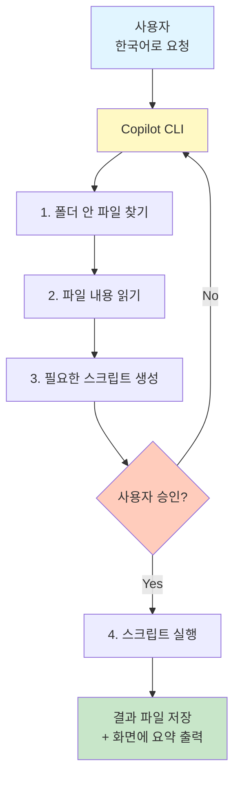
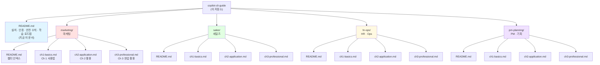
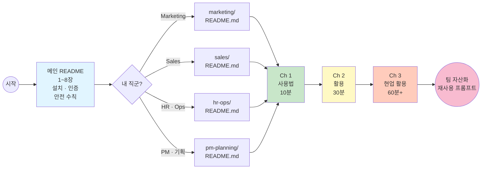

# GitHub Copilot CLI 시작 가이드 (비개발자용)

> 마케팅, 세일즈, HR, 기획 등 **개발자가 아닌 분들이 GitHub Copilot CLI를 처음 설치하고 실무에 활용하는 방법**을 처음부터 끝까지 안내합니다.

터미널이 무엇인지 몰라도 괜찮습니다. 이 문서를 위에서부터 순서대로 따라오시면 됩니다. 명령어는 전부 **그대로 복사해서 붙여넣기**만 하면 동작하도록 준비되어 있습니다.

---

## 목차

1. [GitHub Copilot CLI가 뭔가요?](#1-github-copilot-cli가-뭔가요)
2. [왜 비개발 직군에서 써야 하나요?](#2-왜-비개발-직군에서-써야-하나요)
3. [준비물 체크리스트](#3-준비물-체크리스트)
4. [설치하기 (Windows / macOS)](#4-설치하기-windows--macos)
5. [첫 실행과 GitHub 로그인](#5-첫-실행과-github-로그인)
6. [5분 만에 배우는 기본 사용법](#6-5분-만에-배우는-기본-사용법)
7. [슬래시 명령어와 옵션 치트시트](#7-슬래시-명령어와-옵션-치트시트)
8. [반드시 알아야 할 안전 수칙](#8-반드시-알아야-할-안전-수칙)
9. [이 저장소 사용법 (학습 로드맵)](#9-이-저장소-사용법-학습-로드맵)
10. [자주 하는 실수와 트러블슈팅](#10-자주-하는-실수와-트러블슈팅)
11. [다음 단계 / 공식 자료](#11-다음-단계--공식-자료)

---

## 1. GitHub Copilot CLI가 뭔가요?

한 줄 요약:

> **"내 컴퓨터의 파일을 읽고, 명령을 실행하고, 결과를 요약해 주는 AI 비서"** 를 **터미널(검은 화면)** 에서 대화하듯이 사용할 수 있는 도구입니다.

조금 더 자세히 풀면:

- **GitHub Copilot** 은 원래 개발자가 코드를 작성할 때 도와주는 AI입니다.
- 그중 **CLI (Command Line Interface, 명령줄 인터페이스)** 버전은, 이 AI를 **웹 브라우저나 IDE 없이 터미널에서** 바로 부를 수 있게 해 줍니다.
- 2025년 이후 공개된 새 버전은 **"에이전트(agent)"** 방식으로 동작합니다. 즉, "이 폴더의 CSV 3개를 하나로 합쳐서 결과를 요약해줘" 처럼 **자연어로 시키면 AI가 알아서 파일을 읽고, 명령을 실행하고, 결과를 보여줍니다.**

### 그럼 ChatGPT / Copilot Chat 과 뭐가 다르죠?

| 항목 | ChatGPT / 웹 챗봇 | GitHub Copilot CLI |
|---|---|---|
| 대화만 하기 | 가능 | 가능 |
| 내 컴퓨터의 파일 직접 읽기 | 파일을 매번 업로드해야 함 | **폴더에 있는 그대로 바로 읽음** |
| 명령/스크립트 실행 | 안 됨 (제안만 함) | **직접 실행 가능 (승인 필요)** |
| GitHub 저장소·이슈·PR 다루기 | 링크로만 가능 | **자연어로 바로 조작** |
| 결과를 파일로 저장 | 복사·붙여넣기 필요 | **바로 파일로 저장** |

**핵심 차이**: Copilot CLI 는 "**말로 시키면 내 폴더에서 실제로 손발이 되어 움직여 주는 AI**" 라는 점입니다.

### 그림으로 보는 흐름



---

## 2. 왜 비개발 직군에서 써야 하나요?

지금까지 "코딩을 못 해서 못 했던 일" 들을 **한국어로 말만 하면 해결** 할 수 있게 됩니다. 특히 아래 상황이 자주 있는 분이라면 하루 1~2시간을 절약할 수 있습니다.

- 엑셀/CSV 파일을 **반복적으로 정리**하는 일이 많다 (VLOOKUP·중복 제거·컬럼 재정렬 등)
- **파일 이름 일괄 변경**, **이미지 리사이즈** 같은 잡업이 자주 발생한다
- 여러 문서(PDF, DOCX, MD)를 **한꺼번에 요약**하거나 특정 조항을 찾아야 한다
- **매주·매월 같은 리포트**를 만드는데 매번 손으로 한다
- 개발팀에 요청해야 겨우 되는 자잘한 자동화가 자주 필요하다

특히 다음과 같은 상황에서 강력합니다:

1. **한 번만 잘 물어보면 다음번엔 그대로 재사용** 가능 (프롬프트가 곧 자산)
2. **결과를 파일로 남기고 승인 후 실행** 하므로 사고 위험 낮음
3. 사용한 프롬프트를 팀에 공유하면 **동료도 즉시 같은 결과** 를 얻을 수 있음

---

## 3. 준비물 체크리스트

시작하기 전에 아래 3가지를 준비하세요. 하나라도 없으면 설치가 안 됩니다.

### 3.1 GitHub Copilot 유료 구독

- Copilot CLI 는 **유료 구독이 있어야 사용 가능**합니다.
- Copilot Free / Pro / Business / Enterprise 어느 것이든 됩니다.
- **회사 계정으로 구독 중이라면 관리자가 CLI 사용을 허용해두었는지 반드시 확인**하세요.
  (관리자가 조직 설정에서 Copilot CLI 를 막아둔 경우 사용 불가)

구독 확인 및 신청: [https://github.com/features/copilot/plans](https://github.com/features/copilot/plans)

### 3.2 GitHub 계정 로그인

- [https://github.com](https://github.com) 에 가입되어 있고, 자기 이메일/비밀번호로 로그인 가능해야 합니다.
- 소속 조직(회사 GitHub)이 있다면 그 조직에 소속되어 있어야 합니다.

### 3.3 최신 운영체제 + 터미널

| OS | 요구사항 |
|---|---|
| **Windows** | Windows 10/11 + **PowerShell 7 이상** (기본 "Windows PowerShell 5"는 안 됨) |
| **macOS** | macOS 12 이상 권장 |
| **Linux** | 최신 LTS 배포판 |

> **팁 (Windows 사용자)**: 시작 메뉴에서 "**Windows Terminal**" 을 검색해 설치하면 편합니다. Microsoft Store 에서 무료 배포됩니다. 그 안에서 "PowerShell 7" 을 실행하세요.

---

## 4. 설치하기 (Windows / macOS)

세 가지 설치 방법 중 **본인 OS 에 맞는 것 하나만** 따라 하시면 됩니다.

> **한 번만 설치하면 됩니다.** 다시 설치할 필요 없습니다.

### 4.1 Windows 사용자 (권장: WinGet)


Windows 10/11 에는 기본적으로 `winget` 이라는 설치 도구가 들어 있습니다.

**Step 1.** 시작 메뉴에서 "**Windows Terminal**" 또는 "**PowerShell**" 을 열기
   - 반드시 **PowerShell 7 이상**이어야 합니다. 버전 확인: `$PSVersionTable.PSVersion`
   - 만약 5.x 로 나오면 [PowerShell 7 설치](https://learn.microsoft.com/powershell/scripting/install/installing-powershell) 를 먼저 하세요.

**Step 2.** 아래 명령어를 **한 줄 복사**해서 붙여넣고 Enter:

```powershell
winget install GitHub.Copilot
```

**Step 3.** 설치가 끝나면 터미널을 **완전히 닫았다가 다시 열고** 아래로 확인:

```powershell
copilot --version
```

버전 번호가 나오면 설치 완료입니다.

> **npm 을 이미 쓰고 계신다면** 이 방법도 됩니다:
> ```powershell
> npm install -g @github/copilot
> ```
> (Node.js 22 이상 필요)

### 4.2 macOS 사용자 (권장: Homebrew)

**Step 1.** `command + space` → "**터미널**" 검색해서 실행

**Step 2.** Homebrew 가 설치되어 있는지 확인:
```bash
brew --version
```
없다면 [Homebrew 설치](https://brew.sh) 부터 하세요 (한 줄 명령으로 끝남).

**Step 3.** 설치:
```bash
brew install --cask copilot-cli
```

**Step 4.** 확인:
```bash
copilot --version
```

### 4.3 Linux 사용자

```bash
curl -fsSL https://gh.io/copilot-install | bash
```

또는 npm:
```bash
npm install -g @github/copilot
```

### 4.4 설치가 안 될 때

- **"command not found"** → 터미널을 완전히 닫고 다시 여세요.
- **"npm : 이 시스템에서 스크립트 실행이 사용 안 함으로 설정되어 있으므로..."** (Windows) → PowerShell 을 관리자 권한으로 열고 다음 실행:
  ```powershell
  Set-ExecutionPolicy -Scope CurrentUser RemoteSigned
  ```
- **npm 이 없다** → [Node.js 22 이상](https://nodejs.org) 을 설치하세요. LTS 버전을 받으세요.

---

## 5. 첫 실행과 GitHub 로그인

**Step 1.** 터미널에서 **작업할 폴더로 이동** 하세요.

예를 들어 바탕화면에 `copilot-test` 라는 폴더를 만들고, 그 안에 CSV·문서 몇 개를 넣어두었다면:

```powershell
# Windows
cd $env:USERPROFILE\Desktop\copilot-test
```

```bash
# macOS
cd ~/Desktop/copilot-test
```

> **왜 폴더 이동이 중요한가요?**
> Copilot CLI 는 **실행한 폴더 안의 파일만** 봅니다. 폴더 밖의 파일은 건드리지 못하도록 안전 장치가 걸려 있습니다. (매우 중요한 안전장치)
>
> **바탕화면이나 문서 폴더 최상위에서는 실행하지 마세요.** 민감한 파일이 노출될 수 있습니다. 반드시 **작업용 하위 폴더** 를 만들고 그 안에서 실행하세요.

**Step 2.** 실행:

```bash
copilot
```

**Step 3.** 처음 실행하면 로그인 안내가 나옵니다. 화면에 나온 대로 **`/login`** 을 입력하고 Enter:

```
> /login
```

그러면 다음과 비슷한 안내가 나옵니다:

```
Please visit https://github.com/login/device
and enter code: XXXX-XXXX
```

**Step 4.** 브라우저에서 위 주소로 접속 → 코드 입력 → GitHub 로그인 승인.

**Step 5.** 터미널 창으로 돌아오면 로그인 완료 메시지가 뜹니다. 이제 사용 준비 끝.

> **한 번 로그인하면 다음부터는 자동 로그인** 됩니다. 매번 로그인할 필요 없습니다.

---

## 6. 5분 만에 배우는 기본 사용법

Copilot CLI 는 **두 가지 사용 모드**가 있습니다.

### 6.1 대화형 모드 (Interactive) — 초보자 권장

**언제 쓰나요?** 이것저것 시켜 보고, 결과를 확인하면서 이어서 작업할 때. **처음 배울 땐 무조건 이 모드.**

**시작:**
```bash
copilot
```

프롬프트가 나오면 그냥 **한국어로 말하세요**:

```
> 이 폴더에 있는 csv 파일 목록을 보여줘
```

Copilot 이 답을 하고, 필요한 경우 명령을 실행하려고 **승인을 요청** 합니다:

```
Copilot would like to run: ls *.csv
1. Yes
2. Yes, and approve this tool for the rest of this session
3. No, and tell Copilot what to do differently
```

- **1** : 이번 한 번만 실행 허용
- **2** : 이번 세션 동안은 다시 안 물어봄 (권장)
- **3** : 거부하고 다른 방법 요청

> **끝낼 때**: `/exit` 를 입력하거나 `Ctrl + C` 두 번.

### 6.2 원샷 모드 (Programmatic) — 익숙해진 후

**언제 쓰나요?** 짧고 단순한 질문 하나만 하고 바로 답을 받고 싶을 때. 배치 스크립트에 넣을 때.

```bash
copilot -p "이 폴더의 파일 개수를 세줘"
```

`-p` 는 "**p**rompt" 의 약자입니다. `-s` 를 붙이면 부가 정보 없이 답만 나옵니다:

```bash
copilot -sp "오늘 날짜를 YYYY-MM-DD 형식으로 알려줘"
```

### 6.3 두 가지 모드: Ask/Execute vs Plan

대화형 모드 안에서 **`Shift + Tab`** 을 누르면 모드가 바뀝니다:

| 모드 | 특징 | 언제 쓰나 |
|---|---|---|
| **Ask/Execute** (기본) | 시키면 바로 실행 시도 | 간단한 작업 |
| **Plan** | 먼저 계획을 세워서 보여주고, 확인받은 후 실행 | 복잡하거나 여러 파일을 건드리는 작업 |

> **복잡한 작업일수록 Plan 모드로 하세요.** "먼저 어떻게 할 건지 계획만 보여줘" 가 자동으로 됩니다.

---

## 7. 슬래시 명령어와 옵션 치트시트

대화 중에 `/` 로 시작하는 명령을 쓰면 **특수 기능**을 부를 수 있습니다.

### 7.1 자주 쓰는 슬래시 명령

| 명령 | 하는 일 |
|---|---|
| `/help` | 도움말 전체 보기 |
| `/login` | GitHub 로그인 (처음 한 번) |
| `/logout` | 로그아웃 |
| `/model` | 사용 모델 변경 (기본은 Claude Sonnet 4.5, GPT-5 등 선택 가능) |
| `/context` | 현재 대화가 얼마나 긴지, 토큰 사용량 확인 |
| `/compact` | 대화 요약해서 짧게 압축 (길어졌을 때) |
| `/sandbox enable` | 로컬 샌드박스 켜기 (파일/네트워크 접근 제한) |
| `/mcp` | 외부 도구(MCP 서버) 관리 |
| `/feedback` | 피드백 제출 |
| `/exit` | 종료 |

### 7.2 자주 쓰는 실행 옵션 (`copilot` 명령어 뒤에 붙임)

| 옵션 | 하는 일 | 예시 |
|---|---|---|
| `-p "질문"` | 대화 안 하고 한 번만 물어봄 | `copilot -p "오늘 요일 알려줘"` |
| `-s` | 답만 간결하게 출력 | `copilot -sp "..."` |
| `--allow-tool='shell(git)'` | git 명령은 승인 없이 실행 허용 | 반복 작업 자동화용 |
| `--deny-tool='shell(rm)'` | rm(파일 삭제)은 절대 못 하게 막음 | **안전용, 필수 추천** |
| `--allow-all-tools` | 모든 것 승인 없이 실행 | **위험, 절대 그냥 쓰지 말 것** |
| `--model MODEL` | 사용할 모델 지정 | `--model gpt-5` |

### 7.3 안전한 실행 조합 (초보자 추천)

```bash
copilot --deny-tool='shell(rm)' --deny-tool='shell(git push)'
```

이렇게 실행하면 **파일 삭제(`rm`)와 git push 는 절대 못 함**. 나머지는 매번 승인 여부를 물어봅니다. **처음 몇 주는 이렇게 쓰세요.**

---

## 8. 반드시 알아야 할 안전 수칙

**딱 5가지만 지키면 됩니다.** 진지하게 읽어주세요.

### 규칙 1: 홈 디렉토리, 바탕화면 최상위, 문서 폴더 최상위에서 실행 금지

Copilot CLI 는 실행한 폴더와 그 하위 파일을 모두 볼 수 있습니다. 홈 폴더에서 실행하면 **개인 사진, 카톡 백업, 브라우저 다운로드 등 모든 것에 접근** 가능합니다.

**항상 작업 전용 폴더를 만들고 그 안에서 실행하세요.**

```
좋은 예:   ~/work/marketing-2026-q3-report/
나쁜 예:   ~/    또는   ~/Documents/
```

### 규칙 2: "Trusted directory" 확인 창은 절대 대충 넘기지 마세요

첫 실행 때 "이 폴더를 신뢰하시겠습니까?" 라고 물어봅니다.

- **내가 만든 작업 폴더** → Yes
- **모르는 폴더** → No

### 규칙 3: `--allow-all-tools` 는 절대 쓰지 마세요

이 옵션을 켜면 Copilot 이 **파일 삭제, git 강제 push, 시스템 명령 실행** 을 **아무 승인 없이** 다 할 수 있습니다. 실수로 소중한 파일이 지워질 수 있습니다.

대신 필요한 것만 골라서 허용:
```bash
copilot --allow-tool='shell(ls)' --allow-tool='shell(cat)'
```

### 규칙 4: 승인 요청 창을 반드시 읽고 판단하세요

Copilot 이 명령을 실행하기 전 이런 창이 뜹니다:

```
Copilot would like to run: rm -rf ./output
1. Yes
2. Yes, and approve for session
3. No
```

**"Yes" 를 누르기 전에 반드시 명령을 읽고 이해하세요.** 모르겠다면 3번을 누르고 "이 명령 뭐 하는 건지 설명해줘" 라고 물어보세요.

### 규칙 5: 회사 기밀 파일이 있는 폴더에서는 각별히 주의

Copilot 은 프롬프트 처리를 위해 **파일 내용의 일부를 GitHub 서버(그리고 모델 제공사)로 전송** 합니다.

- 개인정보, 계약서, 비공개 재무 데이터가 든 폴더에서 실행할 때는 회사 정책을 먼저 확인하세요.
- 회사에 별도 "Copilot 이용 지침" 이 있다면 그것을 우선 따르세요.
- 필요 시 `/sandbox enable` 로 로컬 샌드박스를 켜서 네트워크 접근을 제한하세요.

---

## 9. 이 저장소 사용법 (학습 로드맵)

여기까지 오셨다면 설치와 안전 수칙은 완료. 이제 **본인 직군의 폴더로 이동해서 챕터 순서대로** 학습하시면 됩니다.

### 9.1 전체 구조 한눈에 보기



각 직군 폴더는 **동일한 3-챕터 구조** 로 되어 있습니다. 챕터가 올라갈수록 난이도가 올라갑니다.

### 9.2 학습 흐름 (권장 순서)



### 9.3 챕터 시스템 (모든 직군 공통)

| 챕터 | 난이도 | 소요 시간 | 목표 | 다루는 내용 |
|---|---|---|---|---|
| **Ch 1. 사용법** | 초급 ★☆☆ | 10분 | 첫 성공 경험 | Copilot 을 처음 실행해서 3~4개 초간단 명령을 실제로 실행 |
| **Ch 2. 활용** | 중급 ★★☆ | 30분 | 반복 업무 자동화 | 여러 단계로 이뤄진 소규모 워크플로우, 결과 파일 생성 |
| **Ch 3. 현업 활용** | 고급 ★★★ | 60분+ | 팀 자산화 | 여러 데이터 소스 통합, 정기 리포트, 재사용 프롬프트 |


### 9.4 직군 목록

| 직군 | 폴더 | 대표 사용 사례 |
|---|---|---|
| **Marketing** — 캠페인 데이터 · 콘텐츠 운영 | [`marketing/`](./marketing/) | 광고 CSV 통합, 이미지 리사이즈, 경쟁사 모니터링, GA4 임원 보고서 |
| **Sales** — 리드 관리 · 영업 자동화 | [`sales/`](./sales/) | CRM 리드 정규화, 견적서 자동 생성, 계약서 조항 추출, 콜드 아웃리치 |
| **HR / Ops** — 채용 · 운영 | [`hr-ops/`](./hr-ops/) | 이력서 필드 추출, 폴더 리네이밍, 온보딩 체크리스트 |
| **PM / 기획** — 프로젝트 · 데이터 | [`pm-planning/`](./pm-planning/) | 이슈 → 리포트, 회의록 → 액션 아이템, 릴리스 노트 초안 |

### 9.5 이렇게 사용하세요 (Step by Step)

1. **이 메인 README 를 1~8장까지 순서대로** 읽고 설치·로그인 완료
   - 이 단계를 건너뛰면 챕터를 못 따라옵니다. 반드시 완료.
2. **본인 직군 폴더로 이동**
   - 예: 마케터라면 [`marketing/`](./marketing/) 클릭
3. **폴더 안 `README.md` 를 열어서 챕터 인덱스 확인**
   - Ch 1 → Ch 2 → Ch 3 순서로 진행
4. **각 챕터의 예시를 반드시 터미널에서 실제로 실행**
   - 눈으로 읽기만 하면 안 됩니다. 손을 움직여야 배웁니다.
5. **Ch 3 프롬프트는 팀 공유 문서에 저장해서 자산화**
   - 매주·매월 재사용. 옆자리 동료에게도 공유.

### 9.6 팁: 다른 직군 폴더도 훑어보세요

이름만 다를 뿐 실제로 재활용 가능한 프롬프트가 많습니다:

- Marketing 의 "CSV 통합" 프롬프트는 **재무팀 월결산**에 그대로 쓸 수 있습니다.
- HR 의 "이력서 PDF 필드 추출" 프롬프트는 **법무팀 계약서 검토**에도 응용됩니다.
- PM 의 "회의록 → 액션 아이템" 프롬프트는 **어떤 직군에서든** 유용합니다.

---

## 10. 자주 하는 실수와 트러블슈팅

### 10.1 실수 모음

| 증상 | 원인 | 해결 |
|---|---|---|
| `command not found: copilot` | 설치 후 터미널 재시작 안 함 | 터미널 완전히 닫고 다시 열기 |
| "Windows PowerShell 5" 에서 실행 | 구버전 PowerShell | PowerShell 7 이상 설치 후 그걸로 실행 |
| 로그인 안 됨 | 회사 조직에서 CLI 를 막아둠 | GitHub 관리자에게 "Copilot CLI 정책 허용" 요청 |
| 매번 승인 요청 나옴 | 세션마다 초기화됨 | 옵션 2 ("approve for this session") 선택 |
| 잘못 실행됨 | 프롬프트가 애매함 | "먼저 계획만 보여줘" 로 다시 요청. Plan 모드 활용 |
| 답변이 지나치게 짧음 | 컨텍스트 부족 | 폴더 안에 관련 파일이 있는지 확인 후 재요청 |
| 요금이 걱정됨 | 모델별 크레딧 소비 상이 | `/model` 로 저비용 모델 선택. `/context` 로 사용량 확인 |

### 10.2 프롬프트 잘 쓰는 팁 5가지

1. **원본은 건드리지 말 것** 을 명시 → "원본 보존, 결과는 별도 파일로"
2. **먼저 1건/1페이지만 시연** 요청 → "1건만 먼저 만들어 확인받고 진행"
3. **결과 검증용 부산물 요청** → "매핑 로그", "change_log.csv", "신뢰도 컬럼"
4. **되돌리기 가능성** 확보 → "undo 스크립트도 함께 만들어줘"
5. **자동화 결과에는 사람 검토 지시** → "발송/제출 전 사람이 반드시 검토"

### 10.3 자주 묻는 질문 (FAQ)

**Q. 회사 비밀 문서를 다뤄도 되나요?**
A. 회사 정책을 먼저 확인하세요. Copilot 은 프롬프트/파일 내용의 일부를 서버로 전송합니다. 조직에 별도 "생성형 AI 이용 지침" 이 있으면 그것을 우선 따르세요. 필요 시 로컬 샌드박스(`/sandbox enable`) 로 네트워크 노출을 제한할 수 있습니다.

**Q. 요금이 얼마나 나오나요?**
A. Copilot 구독료 안에 포함되며, 요청마다 "프리미엄 요청" 크레딧이 소비됩니다. 자세한 요금은 [Copilot 요금 안내](https://docs.github.com/copilot/managing-copilot/monitoring-usage-and-entitlements/about-premium-requests) 참고. 크레딧 사용량은 `/context` 로 확인 가능합니다.

**Q. 인터넷 없이도 되나요?**
A. 안 됩니다. AI 모델을 GitHub 서버(또는 지정한 프로바이더)와 통신해서 사용합니다.

**Q. 결과가 마음에 안 들면?**
A. 그 자리에서 "이 부분은 이렇게 바꿔줘" 하고 이어서 대화하면 됩니다. 처음부터 완벽한 프롬프트를 쓰려 하지 말고, **대화로 다듬어 가세요.**

**Q. 다른 사람이랑 프롬프트를 공유하고 싶어요.**
A. 프롬프트를 .md 파일로 저장해서 팀 공유 폴더/Notion 에 올려두세요. `.github/copilot-instructions.md` 파일을 프로젝트 폴더에 두면 팀 전체가 같은 컨텍스트로 시작할 수 있습니다 (`copilot init` 로 초기 생성 가능).

**Q. 설치한 버전을 최신으로 올리려면?**
A. `copilot update`. 또는 설치할 때 쓴 도구로 업그레이드 (winget upgrade, brew upgrade, npm update).

**Q. 다이어그램이 이상하게 보여요.**
A. 이 문서 안의 그림은 GitHub 웹에서 볼 때 자동으로 그림으로 그려지는 [Mermaid](https://mermaid.js.org/) 문법입니다. GitHub 웹사이트에서 열면 정상적으로 표시됩니다. 로컬 텍스트 에디터에서 열면 코드로 보일 수 있어요.

---

## 11. 다음 단계 / 공식 자료

이 문서를 다 읽으셨다면 이미 실무의 80% 는 해내실 수 있습니다. 아래는 더 깊이 파보고 싶을 때 참고할 공식 자료입니다.

### 공식 문서

- **GitHub Copilot CLI 소개** — https://docs.github.com/en/copilot/concepts/agents/about-copilot-cli
- **설치 가이드** — https://docs.github.com/en/copilot/how-tos/copilot-cli/set-up-copilot-cli/install-copilot-cli
- **명령어 레퍼런스** — https://docs.github.com/en/copilot/reference/copilot-cli-reference/cli-command-reference
- **Getting Started 튜토리얼** — https://docs.github.com/en/copilot/how-tos/copilot-cli/cli-getting-started
- **GitHub 공식 저장소** (릴리스 노트) — https://github.com/github/copilot-cli
- **Copilot 요금제** — https://github.com/features/copilot/plans

### 커뮤니티

- **Discussions** — https://github.com/github/copilot-cli/discussions
- **Issue 트래커** — https://github.com/github/copilot-cli/issues

### 이 저장소에 기여하기

이 문서에 추가하고 싶은 실무 시나리오가 있다면 언제든지 **Issue** 나 **Pull Request** 로 공유해 주세요. 특히:

- 우리 팀에서 실제로 쓰고 있는 프롬프트
- 실수해서 배운 팁
- 특정 툴 (Salesforce, HubSpot, GA4 등) 연동 예시

를 환영합니다. 팀 전체 자산으로 쌓아 갑시다.

---

**Happy Copiloting.**

*마지막 업데이트: 2026-07-27 (Copilot CLI 정보 기준: 공식 문서 최신판)*
