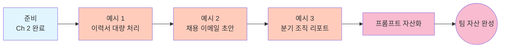

# HR / Ops — Ch 3. 현업 활용 (고급)

> **난이도**: 고급 ★★★ | **소요 시간**: 60분+ | **선수 학습**: [Ch 2. 활용](./ch2-application.md) 완료

Ch 2 에서 반복 잡업 자동화를 배웠다면, 이 챕터는 **이력서 대량 처리, 채용 전형별 대량 이메일 준비, 분기별 조직 리포트** 같은 **정기 대용량 워크플로우** 를 팀 자산으로 만드는 방법을 다룹니다.

여기까지 오시면 채용 시즌 · 분기말 리포트 시즌의 야근이 사라집니다.

---

## 이 챕터에서 배우는 것

- 이력서 PDF 50개에서 **필드를 대량 추출** (개인정보 안전 처리)
- 채용 전형별 **대량 이메일 회신 초안** 자동 생성 (합격 · 불합격 · 대기)
- 분기별 **조직 현황 리포트** 자동 생성 (인력 · 이동 · 이슈)
- 위 워크플로우를 **팀 자산화**

## 학습 흐름



## 이 챕터의 핵심 패턴

HR · Ops 현업 자동화는 **개인정보 보호 + 편향 방지** 가 핵심:

1. **개인정보 파일은 로컬 샌드박스 필수** — `/sandbox enable`
2. **결과 저장 위치 명시적 제한** — "이 폴더 안에만"
3. **평가 · 판단이 개입하는 결과에는 신뢰도 컬럼 + 사람 최종 검토**
4. **이메일 · 통보는 자동 발송 금지** — 반드시 사람 검토 후 발송

---

## 예시 1. 이력서 PDF 50개 대량 필드 추출

**상황**: 채용 공고에 지원한 이력서 50개 PDF. 이름 · 연락처 · 경력 · 이전 회사 · 주요 스킬을 표로 정리해서 서류 심사 회의에 준비.

**폴더 준비**:
```
~/work/hiring-backend-202608/
  resumes/
    resume_001.pdf ~ resume_050.pdf
  job_description.md                (채용 공고 원문)
  scoring_rubric.md                 (평가 기준 정의)
```

**시작 전 필수**:
```
# 반드시 로컬 샌드박스 켜기
copilot
> /sandbox enable
```

**프롬프트**:
```
./resumes/ 폴더의 모든 이력서 PDF 를 읽어서 candidates.csv 를 만들어줘.
job_description.md 와 scoring_rubric.md 참고.

컬럼:
- 파일명
- 이름 (개인정보 마스킹 옵션: 켤 것 = 예: "홍**")
- 이메일 도메인만 (@ 이후, 개인정보 최소화)
- 총 경력 년수 (숫자, 없으면 빈칸)
- 최근 회사 3곳 (콤마 구분)
- 주요 기술/툴 (콤마 구분, 상위 5개, JD 기준 매칭)
- JD 매칭 점수 (0-10, scoring_rubric.md 기준)
- 주요 강점 (1문장)
- 주요 우려 (1문장, 없으면 빈칸)
- 신뢰도 (high/medium/low)
- 판단 근거 (1문장, 이력서 어느 부분 참고했는지)

파일명에 [REVIEW] 태그:
- 신뢰도 low
- JD 매칭 점수 4점 미만 (분명한 미스매치)
- 이력서 정보 부족 (경력 년수 계산 불가 등)

산출물:
1. candidates.csv (50건 전체, 정렬: JD 매칭 점수 순)
2. candidates_summary.md (심사 회의 자료)
   - 전체 개요 (총 50건, 매칭 점수 분포, [REVIEW] 건수)
   - Top 10 후보 (매칭 점수 순, 강점 · 우려 함께)
   - 즉시 탈락 후보 (사유 함께)
   - 판단 애매 재검토 후보 ([REVIEW] 태그)

보안 원칙 (반드시 준수):
- 결과 CSV/MD 는 ./resumes/ 폴더 밖으로 이동시키지 말 것
- 전체 이력서 원문을 결과에 복사하지 말 것 (필요한 필드만)
- 학력 · 나이 · 성별 · 지역 정보는 매칭 점수에 반영하지 말 것 (편향 방지)
- 매칭 점수 근거에 "학력이 명문대" 같은 편향 요소가 들어가면 신뢰도 low

먼저 5건만 시연해서 형식 · 편향 이슈가 없는지 보여주고, 승인 후 나머지 45건 진행.
```

**예상 결과**:
- `candidates.csv`: 심사 회의에서 필터링 · 정렬 가능
- `candidates_summary.md`: 회의 자료 즉시 사용

**팁**:
- **개인정보 마스킹 옵션** 을 반드시 켜세요. 회의 자료에 실명 노출 최소화.
- **편향 방지 문구** 를 프롬프트에 명시 — 학력 · 나이 · 성별 · 지역이 매칭 점수에 들어가지 않도록.
- 심사 회의 후 최종 후보군이 정해지면 원본 이력서로 재확인. 이 자동화 결과는 **1차 필터** 용도로만.

---

## 예시 2. 채용 전형별 대량 이메일 회신 초안

**상황**: 서류 심사 후 50명에게 결과 통보 이메일. 합격 5명, 대기 10명, 불합격 35명. 각 카테고리별로 진심어리면서도 일관된 톤의 이메일 초안이 필요.

**폴더 준비**:
```
~/work/hiring-emails-202608/
  results.csv                      (파일명, 이메일, 이름, 결과, 개인화 코멘트)
  templates/
    accept_template.md             (합격 통보 기본 톤)
    hold_template.md               (대기 통보 기본 톤)
    decline_template.md            (불합격 통보 기본 톤)
  company_signature.md             (회사 서명 · 담당자 정보)
```

**프롬프트**:
```
results.csv 기반으로 각 지원자에게 보낼 이메일 초안을 만들어줘.
templates/ 의 각 카테고리 템플릿과 company_signature.md 참고.

출력: emails/{result}/{name}_{email_domain}.md
- result: accept / hold / decline 소분류로 폴더 분리

각 이메일 규칙:

## 공통
- 인사말: 이름 + "님"
- 톤: 정중, 진심, 개인화 (템플릿의 기계적인 느낌 제거)
- 길이: 200~300자
- 서명: company_signature.md 그대로
- 파일 최상단 주석: "⚠️ AI 자동 초안 · 발송 전 반드시 사람 검토"

## Accept (합격)
- 축하 표현 + 다음 단계 (2차 면접 일정 · 준비물)
- results.csv 의 personalization_note 있으면 자연스럽게 언급

## Hold (대기)
- 감사 표현 + 대기 상태 설명 (정직하게, 애매하게 아닌)
- 언제까지 결과 통보할지 명시
- 다른 기회에 지원 가능성 열어두기

## Decline (불합격)
- 감사 표현 + 결과 통보
- 이유는 짧고 정중하게 (개인 능력 폄하 금지)
- 향후 지원 가능성 열어두기 (성장 후 재지원 환영 표현)

산출물:
- emails/accept/, emails/hold/, emails/decline/ 폴더 아래 각 이메일
- emails/README.md 로 발송 매니페스트 (누구에게 어떤 카테고리, 담당자, 발송 예정일)
- emails/personalization_review.md 로 사람 재확인 필요한 지점 표기
  - personalization_note 참조가 어색한 케이스
  - 톤이 너무 딱딱하거나 너무 캐주얼한 케이스

절대 금지:
- 자동 발송 시도 (초안만 생성)
- results.csv 원본 수정
- 이름 · 이메일 이외의 개인정보 이메일 본문에 노출

먼저 각 카테고리 1건씩 (총 3건) 시연 → 톤 조정 후 나머지 진행.
```

**예상 결과**:
- 50개 개인화 이메일 초안
- 카테고리별 폴더 정리
- 담당자가 검토 → 조정 → 실제 발송 (여전히 수동)

**팁**:
- **자동 발송 절대 금지** — 이 종류의 이메일은 반드시 사람 최종 검토.
- **`personalization_review.md`** 는 반드시 함께 요청 — 어색한 개인화를 catch.
- Decline 이메일이 가장 민감. 톤 조정에 시간을 더 쓰세요.

---

## 예시 3. 분기별 조직 현황 리포트

**상황**: 분기 마지막 주에 임원 보고용 조직 현황 리포트. 인력 변동 · 팀별 분포 · 주요 이슈를 한 페이지로 정리.

**폴더 준비**:
```
~/work/quarterly-org-report-Q3-2026/
  hr_data/
    employees_current.csv          (현재 재직자, 컬럼: id, team, role, join_date, level)
    join_leave_log_Q3.csv          (이번 분기 입퇴사 로그)
    internal_transfers_Q3.csv      (팀 이동 로그)
  incidents/
    hr_incidents_Q3.md             (분기 HR 이슈 노트, 익명화된)
  targets/
    hiring_targets_2026.md         (2026년 채용 목표)
```

**프롬프트**:
```
이 폴더의 모든 HR 데이터를 통합해서 quarterly_org_report_Q3_2026.md 를 만들어줘.
hiring_targets_2026.md 와 비교.

문서 구조 (한 페이지 이내):

## Q3 2026 조직 현황 리포트

### Executive Summary (3~5줄)
- 총 인력 (전 분기 대비 증감)
- 이번 분기 핵심 변화 (신규 팀, 대규모 이동 등)
- 임원이 알아야 할 리스크 1가지

### 인력 대시보드
- 표: 현재 총원, 이번 분기 입사/퇴사/이동, 순증감, YoY 성장률
- 팀별 분포 (표 또는 리스트)
- 레벨별 분포

### 채용 목표 대비 실적
- 팀별 채용 목표 vs 실적 (달성/근접/미달)
- 미달 팀의 원인 요약 (인터뷰 부족? 채용 시장 문제?)

### 이동 · 승진 요약
- 팀 이동 건수 및 주요 이동 (팀 규모 크게 바뀐 케이스)
- 승진 건수 (레벨별)

### 주요 HR 이슈 (익명화)
- hr_incidents_Q3.md 참고
- 유형별 (근태 / 갈등 / 정책 위반) 건수만
- 트렌드 (전 분기 대비 증감)

### Q4 액션 아이템 (3가지)
- 채용 · 이동 · 정책 각 1개씩

포맷:
- 표 위주, 한눈에 파악
- 개인 이름 · ID 는 표시하지 않음 (익명화)
- 이슈 상세는 필요 시 별도 confidential 문서로 (이 리포트는 임원 회람용)
- 각 지표마다 데이터 소스 각주

주의:
- 개인정보 유출 방지: 특정 개인을 유추 가능한 조합 (예: "3인 팀에서 1명 퇴사") 은 표기하지 않기
- 이슈 관련 서술은 반드시 익명화된 카테고리 수준만
- 로컬 샌드박스 필수 (/sandbox enable)

산출물:
1. quarterly_org_report_Q3_2026.md (임원 회람용)
2. quarterly_org_report_Q3_2026_appendix.md (HR팀 내부용 상세)
3. quarterly_org_data.csv (원시 지표 데이터, HR팀 재사용용)
```

**예상 결과**:
- 임원 회의 자료 즉시 사용
- HR팀 내부 상세 자료 별도
- 다음 분기 재사용 가능한 원시 데이터

**팁**:
- **익명화 원칙** 을 프롬프트에 명시. 3인 팀에서 1명 퇴사는 개인 특정 가능하므로 표현 조심.
- 매 분기 첫 주에 자동 실행하면 임원 보고 준비 4시간 → 30분.

---

## 프롬프트를 팀 자산으로 만드는 방법

Ch 3 완료 후 팀 자산화 스텝:

### 1. HR 프롬프트 라이브러리 (사내 위키)

```markdown
# HR / Ops Copilot CLI 프롬프트 라이브러리

## 채용
- [이력서 대량 스크리닝](./resume-screening.md)
- [채용 전형별 이메일 초안](./hiring-email-drafts.md)
- [면접 피드백 통합](./interview-feedback-aggregation.md)

## 조직 · 인사
- [분기 조직 현황 리포트](./quarterly-org-report.md)
- [팀별 인력 분포 대시보드](./team-headcount-dashboard.md)

## 온보딩 · 오프보딩
- [신입 온보딩 체크리스트 생성](./onboarding-checklist.md)
- [퇴사자 인수인계 문서 템플릿](./offboarding-handover.md)

## 정책 · 문서
- [사내 정책 통합 요약](./policy-summary.md)
- [규정 준수 감사 초안](./compliance-audit-draft.md)
```

### 2. `.github/copilot-instructions.md` 에 HR 컨텍스트

```markdown
# 회사 HR / Ops 컨텍스트

## 개인정보 처리 원칙
- 이력서 · 인사 데이터는 로컬 샌드박스에서만 (/sandbox enable)
- 결과 파일은 원본 폴더 밖으로 이동 금지
- 회의 자료에는 실명 대신 마스킹 표기 (홍**)

## 편향 방지
- 채용 · 평가 관련 결과에서 다음 요소는 판단 근거로 사용 금지:
  - 학력 (명문대 여부)
  - 나이
  - 성별
  - 지역
  - 결혼 · 육아 여부

## 익명화 원칙 (조직 리포트)
- 3인 이하 팀은 개인 특정 가능하므로 상세 통계 표기 지양
- 이슈 관련 서술은 유형 · 카운트만, 개인 스토리 X

## 이메일 · 통보
- 채용 · 인사 통보는 절대 자동 발송 금지
- AI 초안 → 담당자 검토 → 팀장 승인 → 발송 (3단계 필수)
```

### 3. 정기 실행 루틴

```
채용 시즌 (분기별)    → 이력서 대량 스크리닝 (Ch 3 예시 1)
분기 마지막 주        → 조직 현황 리포트 (Ch 3 예시 3)
매 신규 입사 시       → 온보딩 체크리스트 (Ch 2 예시 2)
```

---

## 이 챕터 완료 체크리스트

- [ ] 예시 1을 실행해서 이력서 50건 스크리닝 결과가 생성됐다 (편향 없음 확인)
- [ ] 예시 2를 실행해서 카테고리별 이메일 초안이 생성됐다 (실제 발송은 안 함)
- [ ] 예시 3을 실행해서 분기 조직 리포트가 익명화 원칙에 맞게 생성됐다
- [ ] 로컬 샌드박스 (`/sandbox enable`) 를 실제로 사용해봤다
- [ ] 프롬프트 하나를 사내 위키에 저장했다
- [ ] `.github/copilot-instructions.md` 에 개인정보 원칙을 넣었다

## 3개 다 성공했다면

**축하합니다.** HR · Ops 팀의 정기 · 대량 워크플로우 3개를 자동화. 채용 시즌 야근이 사라집니다.

## 지금부터

- 프롬프트를 팀 위키에 저장
- 다른 직군 폴더:
  - [Marketing](../marketing/) — 캠페인 · 콘텐츠
  - [Sales](../sales/) — 파이프라인 · 계약
  - [PM / 기획](../pm-planning/) — 프로젝트 · 데이터
- 새 시나리오는 Issue / PR

## 관련 문서

- 챕터 인덱스: [HR / Ops 로드맵](./README.md)
- 이전 챕터: [Ch 2. 활용](./ch2-application.md)
- 메인 README: [../README.md](../README.md)
