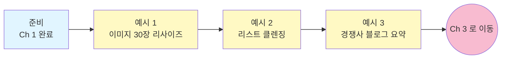

# Marketing — Ch 2. 활용 (중급)

> **난이도**: 중급 ★★☆ | **소요 시간**: 30분 | **선수 학습**: [Ch 1. 사용법](./ch1-basics.md) 완료

Ch 1 에서 파일에 "말 걸기" 를 배웠다면, 이 챕터는 **여러 단계로 이뤄진 실제 자동화** 를 다룹니다. 결과 파일이 생성되고, 원본은 보존됩니다.

---

## 이 챕터에서 배우는 것

- 이미지 여러 장을 **한 번에 리사이즈 + 이름 정리** (원본 보존)
- 뉴스레터 리스트에서 **중복 · 오타 · 무효 데이터 자동 분류**
- 여러 경쟁사 블로그를 **한 번에 방문해서 주간 요약**

## 학습 흐름



## 이 챕터의 핵심 패턴

Ch 1 과 다르게 Ch 2 부터는 **결과 파일이 생기고** **여러 단계 워크플로우** 가 들어옵니다. 아래 3가지 안전 패턴을 프롬프트에 넣는 습관을 들이세요:

1. **원본은 건드리지 말 것** → 결과는 `./output/` 또는 별도 파일로
2. **먼저 1건 시연** → 확인 후 나머지 진행
3. **변환 매핑 로그** → 나중에 검증하거나 되돌리기 위한 부산물

---

## 예시 1. 이미지 30장 일괄 리사이즈 + 파일명 정리

**상황**: 신규 블로그 포스팅에 쓸 이미지 30장. 각 크기가 제각각이고 파일명이 `IMG_1234.jpg` 처럼 관리가 안 됨.

**폴더 준비**:
```
~/work/blog-post-2026-07/
  IMG_1234.jpg
  IMG_1235.jpg
  ...(총 30개)
```

**프롬프트**:
```
이 폴더의 모든 jpg/png 이미지를 아래 규칙으로 정리해줘:

1. 가로 최대 1600px 로 리사이즈 (비율 유지, 세로는 자동)
2. 파일명을 blog-2026-07-01.jpg, blog-2026-07-02.jpg ... 순서로 변경
   (원본 파일명 사전순 정렬 기준)
3. 결과를 ./resized/ 폴더에 저장 (원본은 건드리지 말 것)
4. 변환 전후 파일명과 크기를 rename_map.csv 로 저장
5. 화면에는 상위 5건 매핑만 요약해서 보여주고, 전체는 파일로

먼저 1건만 시연해서 결과를 보여주고, 확인받고 나머지 29건 진행해줘.
```

**예상 결과**:
- `./resized/` 하위에 정리된 이미지 30장 생성
- 원본 폴더의 파일들은 그대로 보존됨
- `rename_map.csv` 파일에 30건 변환 로그 저장
- 화면에는 상위 5건 요약

**Copilot 이 하는 일 (내부적으로)**:
- Python 의 `Pillow` 라이브러리로 이미지 처리 스크립트 자동 생성
- 라이브러리가 없으면 설치 승인 요청 (Yes 눌러 진행)
- 1건 시연 → 승인 대기 → 나머지 진행

**팁**:
- **"세로도 900px 이하로 제한하고, 넘으면 세로 기준 리사이즈"** 같은 조건도 추가 가능.
- 이미지가 아주 많으면 **"진행 중에 5건마다 진척 상황 알려줘"** 로 진행률 확인 가능.

---

## 예시 2. 뉴스레터 발송 리스트 클렌징

**상황**: Mailchimp export 리스트에 중복 이메일, 오타 이메일, 회사 도메인 아닌 것들이 섞여 있음. 발송 전에 정리해야 함.

**폴더 준비**:
```
~/work/newsletter-cleanup/
  mailchimp_export.csv    (컬럼: email, name, signup_date, ...)
```

**프롬프트**:
```
mailchimp_export.csv 를 클렌징해줘:

1. 이메일 중복 제거 (대소문자 무시)
   - 중복 건은 signup_date 가 가장 오래된 것을 남길 것
2. 명백한 오타 이메일 (@ 없음, .com 오타, 잘못된 도메인 등) 은 rejected.csv 로 분리
   - removed_reason 컬럼에 사유 명시
3. 유효 건은 도메인 카테고리 추가:
   - "personal" : gmail, naver, daum, kakao 등 무료 이메일
   - "corporate" : 그 외 도메인
4. 결과 파일:
   - cleaned.csv (유효 건)
   - rejected.csv (제거된 건)
5. 원본 mailchimp_export.csv 는 절대 건드리지 마

마지막에 요약 표로:
- 원본 건수 / 중복 제거 건수 / 오타 제거 건수 / 유효 건수 / personal vs corporate 비율
```

**예상 결과**:
```
클렌징 요약:
| 항목             | 건수   |
|------------------|--------|
| 원본             | 5,234  |
| 중복 제거        | -412   |
| 오타 제거        | -87    |
| 유효 (cleaned)   | 4,735  |
| - personal       | 2,890  |
| - corporate      | 1,845  |
```

- `cleaned.csv` 생성
- `rejected.csv` 생성 (사유 컬럼 포함)
- 원본 보존

**팁**:
- **"이메일 형식이 맞지만 실제로는 존재하지 않을 수도 있으니, cleaned.csv 는 발송 전 SMTP 검증 필요"** 라는 주석을 결과 요약에 넣어달라고 요청 가능.
- 사내 도메인을 "corporate" 로 분리하고 싶으면 **"@company.com 은 별도 category='internal' 로"** 추가.

---

## 예시 3. 경쟁사 블로그 주간 요약

**상황**: 매주 월요일 아침에 경쟁사 5곳 블로그를 확인해야 한다. 매번 5개 사이트를 열어보는 게 지친다.

**폴더 준비**: 특별한 파일 필요 없음. 그냥 작업 폴더 하나만.

**프롬프트**:
```
아래 URL 5개의 블로그를 각각 방문해서 최근 1주일(2026-07-20 ~ 2026-07-27) 새 글의
제목/발행일/핵심 주제(3줄 요약) 를 정리해서 competitors_2026-W30.md 파일로 저장해줘.

URL:
- https://blog.example-a.com
- https://blog.example-b.com
- https://blog.example-c.com
- https://blog.example-d.com
- https://blog.example-e.com

문서 구조:
1. 최상단: "이번 주 3대 트렌드" (5개 블로그 전체를 통합해서 도출)
2. 각 블로그별 새 글 목록 (제목 / 발행일 / 3줄 요약 / 원문 링크)
3. 최하단: "다음 주 우리 팀 액션 제안" 3가지

톤: 담백하되 인사이트 중심. 광고 같은 문장 피할 것.
```

**예상 결과**:
`competitors_2026-W30.md` 파일이 생성되고, 주간 회의에 그대로 붙여넣을 수 있는 형태:

```markdown
# 경쟁사 블로그 주간 요약 (2026-W30)

## 이번 주 3대 트렌드
1. ...
2. ...
3. ...

## 블로그 A (2건)
### [블로그 제목](원문 링크) · 2026-07-22
- ...
- ...
- ...

## 블로그 B (1건)
...

## 다음 주 우리 팀 액션 제안
1. ...
2. ...
3. ...
```

**팁**:
- **매주 같은 프롬프트 재사용** — 날짜만 바꾸면 됨.
- **`~/work/competitor-watch/2026-W30/` 폴더 하나 만들어두고 매주 그 안에서 실행** 하면 히스토리가 쌓임.
- 사이트가 로그인 필요하거나 JS 렌더링이 필요하면 Copilot 이 못 읽을 수 있음. 그럴 때는 "**직접 접근이 안 되면 어떤 URL 이 문제인지 알려줘**" 를 추가.

---

## 이 챕터 완료 체크리스트

- [ ] 예시 1을 실행해서 이미지 여러 장이 실제로 리사이즈 · 리네이밍되어 `./resized/` 에 생성됐다
- [ ] 예시 1의 `rename_map.csv` 매핑 로그 파일도 함께 생성됐다
- [ ] 예시 2를 실행해서 `cleaned.csv` 와 `rejected.csv` 가 생성됐다
- [ ] 예시 3을 실행해서 경쟁사 요약 마크다운 파일이 생성됐다
- [ ] "1건 시연 → 승인 → 나머지" 안전 패턴을 실제로 경험했다
- [ ] "원본 보존 + 결과는 별도 파일" 패턴을 프롬프트에 명시하는 습관이 생겼다

## 3개 다 성공했다면

**축하합니다.** 이제 마케팅 잡업의 상당 부분을 자동화할 수 있습니다. 매주 · 매월 반복되는 정기 리포트 자동화로 넘어갈 준비가 됐습니다.

## 다음 챕터로

→ [Ch 3. 현업 활용 — 정기 리포트 자산화](./ch3-professional.md) (60분+, 광고 CSV 통합 UTM 리포트 · GA4 임원 보고서 · 월간 대시보드)

## 관련 문서

- 챕터 인덱스: [Marketing 로드맵](./README.md)
- 이전 챕터: [Ch 1. 사용법](./ch1-basics.md)
