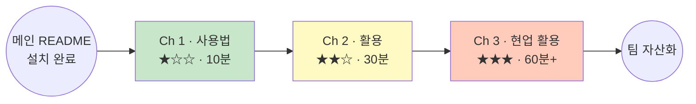

# PM / 기획 — GitHub Copilot CLI 학습 로드맵

> **GitHub 이슈/PR 진행 상황 리포팅, 회의록 → 액션 아이템 추출, 릴리스 노트 초안** 등 PM · 기획 실무를 CLI 로 자동화하는 3-챕터 코스.

이 폴더는 [메인 가이드](../README.md) 의 PM / 기획 편입니다. **먼저 [메인 README](../README.md) 의 1~8장(설치 · 인증 · 안전 수칙)을 완료**하고 오세요.

PM · 기획 직군은 특히 **GitHub 저장소 · 이슈 · PR 을 자연어로 다루는** 기능을 가장 많이 활용합니다. Copilot CLI 는 GitHub API 를 내장하고 있어 별도 설정 없이 저장소를 조회 · 조작할 수 있습니다.

---

## 학습 흐름

## 챕터 목차

| # | 챕터 | 난이도 | 소요 | 파일 |
|---|---|---|---|---|
| Ch 1 | 사용법 — 이슈·PR·커밋에 말 걸기 | 초급 ★☆☆ | 10분 | [`ch1-basics.md`](./ch1-basics.md) |
| Ch 2 | 활용 — 회의록 액션 추출, 릴리스 노트, 이슈 트리아지 | 중급 ★★☆ | 30분 | [`ch2-application.md`](./ch2-application.md) |
| Ch 3 | 현업 활용 — 주간 리포트 · 회고 · 로드맵 진행률 | 고급 ★★★ | 60분+ | [`ch3-professional.md`](./ch3-professional.md) |

---

## 각 챕터에서 배우는 것

### Ch 1. 사용법 (초급)

**목표**: GitHub API 내장 기능으로 저장소 · 이슈 · PR 에 "말을 걸어보는" 첫 경험.

다루는 예시:
- 내가 담당인 open 이슈 목록 보기
- 특정 PR 을 3줄로 요약 받기
- 이번 주 커밋 통계 확인

→ [Ch 1 시작하기](./ch1-basics.md)

### Ch 2. 활용 (중급)

**목표**: 반복 문서 작업 자동화. 회의 · 릴리스 · 트리아지에 활용.

다루는 예시:
- 회의록 5개 → 담당자별 액션 아이템 표
- PR 12건 → 릴리스 노트 초안 (카테고리 자동 분류)
- 특정 라벨 붙은 이슈 일괄 트리아지

→ [Ch 2 시작하기](./ch2-application.md)

### Ch 3. 현업 활용 (고급)

**목표**: 정기 리포트 자동화 + 로드맵 · 회고 자료를 팀 자산으로.

다루는 예시:
- GitHub 이슈 → 주간 상태 리포트 (Executive Summary 포함)
- 스프린트 회고 자료 자동 생성 (완료 · 지연 · 인사이트)
- 로드맵 대비 진행률 대시보드

→ [Ch 3 시작하기](./ch3-professional.md)

---

## 다른 직군

- [Marketing — 캠페인 데이터 & 콘텐츠 운영](../marketing/)
- [Sales — 리드 관리 & 영업 자동화](../sales/)
- [HR / Ops — 채용 & 운영](../hr-ops/)

## 관련 문서

- 메인 가이드: [../README.md](../README.md) — 설치 · 인증 · 안전 수칙 · FAQ

## 기여

새로운 PM / 기획 시나리오나 특정 도구 (Jira, Linear, Notion) 연동 예시가 있으면 Issue / PR 로 공유해 주세요.
