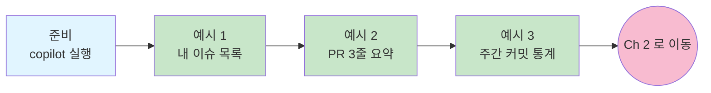

# PM / 기획 — Ch 1. 사용법 (초급)

> **난이도**: 초급 ★☆☆ | **소요 시간**: 10분 | **선수 학습**: [메인 README](../README.md) 의 1~8장 완료 (설치 · 로그인)

이 챕터는 Copilot CLI 를 처음 켜고 **GitHub 저장소 · 이슈 · PR 에 "말을 걸어보는" 첫 경험** 을 위한 것입니다. Copilot CLI 는 GitHub API 를 내장하고 있어 별도 설정 없이 저장소를 조회 · 조작할 수 있습니다.

---

## 이 챕터에서 배우는 것

- 내 담당 **open 이슈 목록** 을 저장소 기준으로 정리해서 받기
- 특정 **PR 을 3줄 요약** 으로 빠르게 파악하기
- 저장소의 **이번 주 커밋 통계** 를 담당자별로 확인하기

## 학습 흐름



## 준비물

PM · 기획 챕터는 **실제 GitHub 저장소** 를 대상으로 합니다. 다음이 필요합니다:

- 회사 GitHub 조직에 소속되어 있고 어떤 저장소에 접근 권한이 있음
- (아니면) 본인이 접근 가능한 아무 공개 저장소 하나를 예시로 사용 가능

이 챕터의 예시에 나오는 `octo-org/octo-repo` 는 예시 저장소 이름입니다. **본인 저장소 이름으로 바꿔서** 실행하세요.

작업 폴더는 크게 상관없지만, 어떤 폴더든 새로 만들어서 시작하는 것을 권장:

```bash
# Windows
mkdir $env:USERPROFILE\work\copilot-ch1-pm
cd $env:USERPROFILE\work\copilot-ch1-pm

# macOS
mkdir -p ~/work/copilot-ch1-pm
cd ~/work/copilot-ch1-pm

# 그리고 실행
copilot
```

---

## 예시 1. 내가 담당인 open 이슈 목록

**상황**: 아침에 출근해서 오늘 뭘 할지 정리하기 전에, 내가 담당인 모든 저장소의 이슈를 한 번에 보고 싶다.

**프롬프트**:
```
내가 assignee 인 모든 저장소의 open 이슈를 조회해서,
저장소별로 그룹핑해서 보여줘. 최근 업데이트 순으로 정렬.

각 이슈는 다음 정보로 표시:
- 제목
- 이슈 번호
- 라벨
- 마지막 업데이트 (며칠 전)
```

**예상 결과**:
```
## octo-org/backend (3건)

- #142 API 스펙 문서 업데이트 [documentation] · 2일 전
- #138 로그인 실패 시 에러 메시지 개선 [bug, priority-high] · 4일 전
- #135 사용자 프로필 API 리팩토링 [refactor] · 1주 전

## octo-org/frontend (1건)

- #89 대시보드 페이지 로딩 속도 개선 [performance] · 3일 전
```

Copilot 이 GitHub API 호출을 승인하려고 물어봅니다. **2번 (approve for session)** 을 눌러 세션 동안 반복 승인 없이 진행하세요.

**팁**:
- "**우선순위 라벨 (priority-*) 있는 것만 필터해줘**" 로 좁힐 수 있음.
- 결과가 좋으면 **"이 결과를 my_tasks_20260727.md 로 저장해줘"** 로 파일화.

---

## 예시 2. 특정 PR 3줄 요약

**상황**: 리뷰 요청 받은 PR 링크가 왔다. 슬랙 확인하고 눌러 들어가기 전에, 뭐 하는 PR 인지 3줄로만 빠르게 파악하고 싶다.

**프롬프트**:
```
PR https://github.com/octo-org/octo-repo/pull/142 을 3줄로 요약해줘.
포함할 정보:
- 무엇을 하는 PR 인가 (1줄)
- 어떤 파일들이 어떻게 바뀌었는가 (1줄)
- 리뷰 시 특히 봐야 할 부분 (1줄)
```

**예상 결과** (예시):
```
1. 사용자 로그인 API 의 에러 메시지를 사용자 친화적으로 개선하는 PR입니다.
   (기존: "Invalid credentials" -> 변경: "이메일 또는 비밀번호가 일치하지 않습니다")

2. 변경 파일 3개: src/api/auth.ts (에러 메시지 리터럴 교체),
   src/i18n/ko.json (한국어 메시지 추가), tests/auth.test.ts (테스트 케이스 업데이트).

3. i18n 키 이름 규칙이 기존 코드베이스와 다른 부분이 있어 이 부분을 유의해서 볼 것.
```

이 정보만으로도 **"지금 리뷰할 수 있을지 / 나중으로 미룰지"** 결정할 수 있습니다.

**팁**:
- **"체크리스트 형태로 리뷰 포인트 5개 뽑아줘"** 로 이어서 요청하면 리뷰 준비 완료.
- **"이 PR 이 이슈 #135 와 어떤 관계인지도 알려줘"** 로 컨텍스트 파악 가능.

---

## 예시 3. 이번 주 커밋 통계

**상황**: 주간 회의 전에 팀이 이번 주 뭘 했는지 담당자별로 요약해서 슬랙에 미리 공유하고 싶다.

**프롬프트**:
```
octo-org/octo-repo 저장소의 이번 주 (월~금) main 브랜치 커밋을
담당자별로 정리해서 표로 보여줘.

각 담당자마다:
- 커밋 개수
- 주요 커밋 메시지 3개 (짧게 요약)
- 관련된 이슈/PR 번호 (있으면)

마지막에 팀 전체 총 커밋 수와 어떤 주제가 가장 활발했는지 1줄 요약도.
```

**예상 결과**:
```
## 이번 주 팀 커밋 요약 (2026-07-20 ~ 2026-07-24)

| 담당자    | 커밋 | 주요 작업                                     |
|-----------|------|-----------------------------------------------|
| @kim      | 8    | 로그인 에러 메시지 개선 (#142)                |
|           |      | 프로필 API 리팩토링 (#135)                    |
|           |      | i18n 키 정리                                  |
| @lee      | 5    | 대시보드 성능 개선 (#89)                      |
|           |      | 차트 렌더링 최적화                            |
|           |      | E2E 테스트 추가                                |
| @park     | 3    | 문서 업데이트 (#142)                          |
|           |      | 신규 온보딩 가이드                            |
|           |      | 컨벤션 문서 개선                              |

**팀 총 커밋**: 16건
**주요 주제**: 로그인 UX 개선 (에러 메시지 + 문서화) 이 이번 주의 가장 큰 흐름
```

이 요약을 그대로 슬랙 · 주간 회의 문서에 붙여넣기 가능.

**팁**:
- **매주 월요일 아침에 같은 프롬프트 재사용** — 날짜만 자동으로 인식됨.
- **"각 담당자 성과에 대한 짧은 코멘트도 추가해줘"** 를 요청하면 회고 자료로도 확장 가능.

---

## 이 챕터 완료 체크리스트

- [ ] 예시 1을 실행해서 내 이슈 목록을 받았다
- [ ] 예시 2를 실행해서 PR 요약을 받았다
- [ ] 예시 3을 실행해서 주간 커밋 통계를 받았다
- [ ] Copilot CLI 가 GitHub API 를 내장하고 있어 저장소를 자연어로 다룰 수 있다는 것을 확인했다
- [ ] 프롬프트에 저장소 이름 (`org/repo`) 을 정확히 명시하면 결과 정확도가 올라간다는 것을 이해했다

## 3개 다 성공했다면

**축하합니다.** GitHub 저장소를 자연어로 다루는 첫 경험 완료. PM · 기획의 반복 문서 작업 자동화로 넘어갈 준비가 됐습니다.

## 다음 챕터로

→ [Ch 2. 활용 — 회의록 액션 추출, 릴리스 노트, 이슈 트리아지](./ch2-application.md) (30분)

## 관련 문서

- 챕터 인덱스: [PM / 기획 로드맵](./README.md)
- 안전 수칙 다시 보기: [메인 README 8장](../README.md#8-반드시-알아야-할-안전-수칙)
