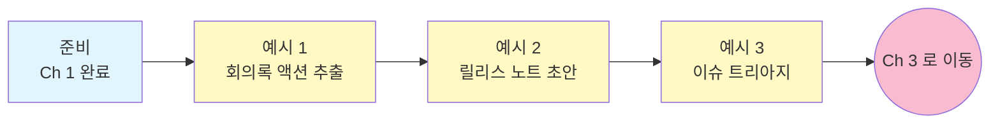

# PM / 기획 — Ch 2. 활용 (중급)

> **난이도**: 중급 ★★☆ | **소요 시간**: 30분 | **선수 학습**: [Ch 1. 사용법](./ch1-basics.md) 완료

Ch 1 에서 GitHub 저장소에 "말 걸기" 를 배웠다면, 이 챕터는 **회의록 액션 아이템 추출, 릴리스 노트 초안 작성, 이슈 대량 트리아지** 같은 **PM · 기획의 반복 문서 작업 자동화** 를 다룹니다.

---

## 이 챕터에서 배우는 것

- 여러 회의록에서 **담당자별 액션 아이템** 을 자동 추출
- 이번 스프린트 머지된 PR 로 **릴리스 노트 초안** 자동 생성
- 특정 라벨 붙은 이슈를 **일괄 트리아지** (우선순위 · 담당 배정 제안)

## 학습 흐름



## 이 챕터의 핵심 패턴

PM · 기획 자동화의 핵심은 **팀 규칙을 프롬프트에 명시** 하는 것입니다:

1. **날짜 · 기간을 구체적으로** 명시 ("최근" 대신 "지난 7일", "2026-W30")
2. **팀 라벨 · 마일스톤 규칙** 을 프롬프트에 포함 (PR 카테고리 자동 분류에 필수)
3. **원문 인용 유지** (책임 소재 명확, 액션 아이템에 특히 중요)

---

## 예시 1. 회의록 5개 → 담당자별 액션 아이템 표

**상황**: 지난주 회의록 5개 (각 3~5페이지 마크다운). 액션 아이템만 뽑아 담당자별로 정리하고 슬랙에 공유해야 함.

**폴더 준비**:
```
~/work/actions-W30/
  meetings/
    2026-07-22_주간회의.md
    2026-07-23_제품기획.md
    2026-07-24_영업협의.md
    2026-07-25_스프린트리뷰.md
    2026-07-26_임원보고.md
```

**프롬프트**:
```
./meetings/ 폴더의 모든 회의록(.md)을 읽어서
아래 액션 아이템 표를 만들어줘 (actions_W30.md):

각 액션 아이템 컬럼:
- 담당자 (원문에 명시된 사람 이름/아이디)
- 액션 아이템 (원문에서 그대로 인용, 요약 금지)
- 마감일 (원문에 명시된 경우만, 없으면 "미지정")
- 관련 회의 (파일명과 회의 날짜)
- 우선순위 (원문에서 유추, high/medium/low)
- 근거 (판단한 근거 짧게, 예: "회의록 3번째 섹션에서 CEO가 '이번 주 안에' 라고 명시")

문서 구조:
1. Executive Summary (3줄): 이번 주 액션 총 N건, 담당자별 최다, 마감 임박 건수
2. 담당자별 액션 아이템 표 (담당자별 그룹핑, 우선순위 순 정렬)
3. "마감일 미지정" 별도 섹션 (매니저가 배정 필요)
4. "high 우선순위" 별도 섹션 (즉시 팔로업 필요)

톤: 담백하게. 액션 원문은 그대로 인용해서 왜곡 방지.
```

**예상 결과**:
```markdown
# 2026-W30 액션 아이템

## Executive Summary
- 이번 주 액션 총 23건
- 최다 담당: 김철수 (7건)
- 마감 임박 (3일 내): 4건

## 담당자별 액션 아이템

### 김철수 (7건)

| 우선순위 | 액션 | 마감 | 회의 |
|---|---|---|---|
| high | "API 스펙 문서 초안 완성" | 2026-07-31 | 2026-07-22 주간회의 |
| medium | "Q3 목표 초안 공유" | 2026-08-05 | 2026-07-24 영업협의 |
...

## 마감일 미지정 (3건)
...

## High 우선순위 (5건)
...
```

**팁**:
- **원문 인용 유지가 핵심** — AI 가 요약하다가 원 뜻과 다르게 바꾸면 책임 소재 애매해짐.
- **"근거" 컬럼 요청** 은 나중에 "왜 이게 액션인가요?" 라는 질문에 답할 수 있게 해줌.
- 이 표를 그대로 슬랙 · Notion 에 붙여넣기, 또는 담당자별 개별 DM 초안까지 요청 가능: **"각 담당자별로 개인 DM 초안도 함께 만들어줘"**

---

## 예시 2. PR 12건 → 릴리스 노트 초안

**상황**: 이번 스프린트 (2주) 에서 main 브랜치에 머지된 PR 12건. 이걸 카테고리별로 정리한 릴리스 노트 초안이 필요.

**프롬프트**:
```
octo-org/octo-repo 저장소에서 지난 2주간 (2026-07-14 ~ 2026-07-27) main 브랜치에 머지된 PR 을 모두 조회해서
release_notes_v2.14.md 초안을 만들어줘.

카테고리 분류 규칙:
- New Features: label 에 "feature" 또는 PR 제목이 "feat:" 로 시작
- Improvements: label 에 "enhancement" 또는 PR 제목이 "improve:", "refactor:" 로 시작
- Bug Fixes: label 에 "bug" 또는 PR 제목이 "fix:" 로 시작
- Breaking Changes: label 에 "breaking" 또는 PR body 에 "BREAKING CHANGE" 포함
- 내부 리팩토링 (label:internal, chore) 은 릴리스 노트에서 제외

각 항목 포맷:
- (한 줄 사용자 관점 설명) — PR #번호 by @담당자

포맷 예시:
## New Features
- 사용자 프로필에 배경 이미지 업로드 지원 — PR #142 by @kim
- 대시보드 위젯 드래그 앤 드롭 재배치 — PR #148 by @lee

## Improvements
- ...

## Bug Fixes
- ...

## Breaking Changes
(없으면 이 섹션 생략)

주의사항:
- PR 제목이 개발자 관점으로 쓰여진 경우 (예: "auth 미들웨어 로직 수정")
  → 사용자 관점으로 재작성 (예: "로그인 시 간헐적 오류 수정")
- 카테고리가 애매하면 needs_review = Y 로 표시하고 담당자에게 확인 요청

마지막에 release_notes_v2.14_review_notes.md 로:
- 카테고리 판단 애매한 PR 목록
- 사용자 관점으로 재작성한 항목의 원문 → 변경 매핑 (사람 검토용)
```

**예상 결과**:
- `release_notes_v2.14.md`: 즉시 편집 후 배포 가능한 초안
- `release_notes_v2.14_review_notes.md`: 사람이 재검토할 부분

**팁**:
- **팀에서 PR 컨벤션 (feat/fix/refactor/chore) 를 통일** 해두면 이 프롬프트의 정확도가 크게 올라감.
- **매 스프린트 같은 프롬프트 재사용** — 저장소명과 날짜만 바꾸면 됨.
- **`release_notes_review_notes.md`** 를 반드시 함께 요청. 재작성된 문구가 원문과 다를 수 있어서 검증 필수.

---

## 예시 3. 특정 라벨 이슈 일괄 트리아지

**상황**: `needs-triage` 라벨 붙은 이슈가 30건 쌓였다. 우선순위 · 담당 배정을 한 번에 처리하고 싶다.

**프롬프트**:
```
octo-org/octo-repo 저장소의 open 이슈 중 label 에 "needs-triage" 가 붙은 것들을 조회해서,
각 이슈에 대해 아래 정보로 트리아지 제안 표를 만들어줘.

triage_proposals.md 로 저장:

| # | 제목 | 유형 판단 | 우선순위 제안 | 담당 팀 제안 | 근거 | 확신도 |
|---|---|---|---|---|---|---|

- 유형 판단: bug / feature / question / documentation / duplicate
- 우선순위 제안: high / medium / low
  - 판단 기준: 사용자 영향 범위, 관련 라벨 (priority-*), 이슈 본문의 심각도 표현
- 담당 팀 제안: backend / frontend / infra / product / docs (팀 라벨 or 언급된 파일 경로 기반)
- 근거: 왜 이렇게 판단했는지 1문장
- 확신도: high / medium / low (low 는 사람이 반드시 재확인)

문서 구조:
1. Executive Summary: 총 N건, 유형별 분포, high 우선순위 건수, 사람 재확인 필요 건수 (low 확신도)
2. 트리아지 제안 표 (우선순위 순)
3. "즉시 라벨 적용 가능" 섹션 (high 확신도만)
4. "사람 재확인 필요" 섹션 (low 확신도)

실제 라벨 적용은 이번엔 하지 마 — 제안 문서만 만들어. 검토 후 매니저가 직접 적용할 예정.
```

**예상 결과**: `triage_proposals.md` 파일 생성 → 매니저가 30분 안에 검토 → 라벨 일괄 적용 (수동)

**팁**:
- **처음엔 절대 자동 라벨 적용하지 말 것** — 제안만 받아서 사람이 검토.
- 팀에서 이 프롬프트가 잘 작동하면 나중에는 **"high 확신도만 자동 라벨 적용, low 는 제안"** 으로 반자동화 가능.
- **확신도 컬럼 요청** 은 AI 판단이 개입하는 모든 결과물의 필수 습관.

---

## 이 챕터 완료 체크리스트

- [ ] 예시 1을 실행해서 회의록 액션 아이템 표가 생성됐다
- [ ] 예시 2를 실행해서 릴리스 노트 초안 + 검토 노트 2개가 생성됐다
- [ ] 예시 3을 실행해서 트리아지 제안 문서가 생성됐다 (실제 라벨은 미적용)
- [ ] "원문 인용 유지" 가 왜 중요한지 이해했다
- [ ] "확신도 컬럼" 요청이 AI 결과 검증의 핵심이라는 것을 이해했다

## 3개 다 성공했다면

**축하합니다.** PM · 기획의 반복 문서 자동화 감을 잡았습니다. 이제 **주간 상태 리포트 · 스프린트 회고 · 로드맵 진행률 대시보드** 같은 정기 자산으로 갑니다.

## 다음 챕터로

→ [Ch 3. 현업 활용 — 주간 리포트 · 회고 · 로드맵 진행률](./ch3-professional.md) (60분+)

## 관련 문서

- 챕터 인덱스: [PM / 기획 로드맵](./README.md)
- 이전 챕터: [Ch 1. 사용법](./ch1-basics.md)
