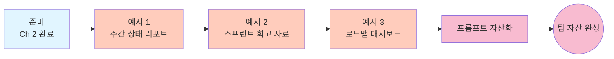

# PM / 기획 — Ch 3. 현업 활용 (고급)

> **난이도**: 고급 ★★★ | **소요 시간**: 60분+ | **선수 학습**: [Ch 2. 활용](./ch2-application.md) 완료

Ch 2 에서 회의록 · 릴리스 노트 · 트리아지 자동화를 배웠다면, 이 챕터는 **주간 상태 리포트, 스프린트 회고 자료, 로드맵 진행률 대시보드** 같은 **팀의 정기 자산** 을 만드는 방법을 다룹니다.

여기까지 오시면 매주 · 매 스프린트 반복되는 리포트 준비가 30분 안에 끝납니다.

---

## 이 챕터에서 배우는 것

- GitHub 이슈 · PR 데이터를 통합해 **주간 상태 리포트** 자동 생성
- 스프린트 종료 시 **회고 자료 초안** 자동 생성 (완료 · 지연 · 인사이트)
- 로드맵 마일스톤 대비 **진행률 대시보드** 유지
- 위 워크플로우를 **팀 자산화** (`.github/copilot-instructions.md`)

## 학습 흐름



## 이 챕터의 핵심 패턴

PM · 기획 현업 자동화는 **팀 컨벤션 정착 + 재실행 자동화** 가 핵심:

1. **PR 라벨 · 마일스톤 규칙을 팀에서 통일** — 자동 분류 정확도 결정
2. **`.github/copilot-instructions.md` 에 팀 규칙 저장** — 담당자 바뀌어도 결과 일관
3. **주간/스프린트 프롬프트를 자산으로** — 매번 5초 재실행
4. **원문 인용 유지 + Executive Summary 별도** — 임원 · 팀원 모두 만족

---

## 예시 1. GitHub 이슈 → 주간 상태 리포트

**상황**: 매주 금요일 오후에 팀 주간 상태 리포트를 만들어야 함. 지난주 완료 · 신규 · 정체 이슈를 한 페이지로 정리하고 슬랙 공유.

**프롬프트**:
```
octo-org/octo-repo 저장소의 지난 7일간 (2026-07-21 ~ 2026-07-27) 이슈/PR 활동을 분석해서
weekly_status_2026-W30.md 리포트를 만들어줘.

리포트 구조:

## Weekly Status · 2026-W30 (07/21 ~ 07/27)

### Executive Summary (3줄)
- 이번 주 완료 N건, 신규 M건, 정체 K건
- 핵심 성과 1개 (임팩트 큰 것)
- 리더가 알아야 할 이슈 1개

### 이번 주 완료 (섹션)
| 이슈 # | 제목 | 담당자 | 관련 PR | 스프린트 목표 |
|---|---|---|---|---|
- 마일스톤 label 이 있으면 그룹핑

### 이번 주 신규 (섹션)
- 우선순위 순 정렬 (priority-high, priority-medium, priority-low)
- 각 이슈: 제목 · 담당자 · 우선순위 · 예상 완료 시점

### 오래 열려 있는 이슈 (30일 이상, Aging Analysis)
- 이슈 · 담당자 · 얼마나 오래 · 마지막 활동 · 팔로업 필요 여부
- 담당자 없는 stale 이슈는 별도 표기 (배정 필요)

### 마일스톤 진척률
- label 이 milestone:* 인 이슈들을 그룹핑
- 각 마일스톤: 완료율 %, 남은 이슈 수, 예상 완료일

### 다음 주 예상 완료 후보
- 스테이지가 in-progress 이고 최근 활동이 활발한 이슈

### Blocked / Needs Decision
- label 이 blocked, needs-decision 인 이슈
- 각 이슈: 무엇이 막혔는가, 누구의 결정이 필요한가

포맷:
- 표 위주
- 담당자는 @mention 형태 (슬랙 붙여넣기 시 자동 링크)
- 날짜는 상대 표기 (예: "3일 전") 병기

주의:
- 이슈 제목은 원문 그대로 (요약하다가 뉘앙스 손실)
- PR 링크는 short link (#123) 형태로
- 팀 컨벤션 (label, milestone 규칙) 이 `.github/copilot-instructions.md` 에 있으면 반드시 참고

산출물:
1. weekly_status_2026-W30.md (슬랙/Notion 공유용)
2. weekly_status_2026-W30_data.json (지표 데이터, 추후 트렌드 분석용)
```

**예상 결과**:
- 금요일 오후 회의 자료 A4 한 장
- JSON 데이터는 월말 리뷰에서 트렌드 분석 재료로 재사용

**팁**:
- **매주 금요일 오후 5시 자동 실행 루틴** 만들기 → 회의 시작 15분 전에 자료 준비 완료.
- **누적된 JSON 데이터** 로 월말에 "지난 4주 트렌드" 대시보드를 다시 만들 수 있음.

---

## 예시 2. 스프린트 회고 자료 자동 생성

**상황**: 2주 스프린트 종료. 회고 회의 30분 전에 팀원들이 볼 수 있는 회고 자료 초안이 필요.

**프롬프트**:
```
octo-org/octo-repo 저장소의 지난 스프린트 (2026-07-14 ~ 2026-07-27, 2주) 활동을 분석해서
sprint_retro_2026-Sprint15.md 회고 자료를 만들어줘.

포함할 내용:

## Sprint 15 회고 자료 (07/14 ~ 07/27)

### 스프린트 목표 대비 실적
- 스프린트 시작 시 설정된 이슈 (마일스톤 sprint-15 라벨 기준)
- 완료 / 부분 완료 / 미완료 각 카운트 + 이슈 리스트
- 달성률 %

### Kudos · Highlights (긍정)
- 이번 스프린트 임팩트 큰 성과 3~5개
  - 완료된 큰 PR (변경 라인 수 기준 top 5)
  - 예상보다 빨리 완료된 이슈
  - 팀원 서로의 코드 리뷰에서 좋은 상호작용 예시 (있으면)

### What Didn't Go Well (개선점)
- 미완료 사유 카테고리 (스코프 확대 / 예상 밖 이슈 / 외부 블로커)
- 반복적으로 나타난 이슈 (bug 라벨이 계속 붙는 영역)
- Review 사이클이 길었던 PR (리뷰 요청 → 머지 3일 이상)

### 통계
- 팀원별 완료 이슈 수 / PR 수 / 리뷰 수
- 평균 PR 사이클 타임
- Bug 이슈 대비 Feature 이슈 비율

### 다음 스프린트 개선 액션 제안 (5가지)
- 각 액션: 무엇을 / 왜 (이번 스프린트 근거) / 담당 제안

포맷:
- 긍정 섹션과 개선 섹션의 톤 균형 (한쪽만 강조 X)
- 개인 비판이 아닌 프로세스/시스템 관점
- 데이터 근거 항상 함께 (모호한 "체감상" 표현 X)

주의:
- 팀원별 통계는 회의에서 개인 비교로 쓰지 않도록 주의 (컨텍스트 함께 설명)
- 개선점은 사람 탓 X, 시스템/프로세스/도구 관점으로 전환
- Kudos 는 반드시 이번 스프린트 실제 근거로 (일반 칭찬 X)

산출물:
1. sprint_retro_2026-Sprint15.md (팀 공유 자료)
2. sprint_retro_2026-Sprint15_metrics.csv (통계 원본, 재사용용)
```

**예상 결과**: 회고 회의 30분 전 준비 완료. 팀원들이 미리 훑고 회의에서는 논의에 집중.

**팁**:
- **개인 비교로 쓰이지 않도록 회의 시작 시 안내** — "이건 프로세스 개선을 위한 데이터, 개인 평가 X"
- **`sprint_retro_metrics.csv`** 는 시리즈로 쌓으면 "지난 6스프린트 트렌드" 도 볼 수 있음.

---

## 예시 3. 로드맵 대비 진행률 대시보드

**상황**: 분기 로드맵의 마일스톤 진행 상황을 매주 모니터링. 임원 · 관련 팀에 공유할 대시보드가 필요.

**폴더 준비**:
```
~/work/roadmap-dashboard-2026-Q3/
  roadmap_Q3_2026.md              (로드맵 원문: 마일스톤 · 목표 · 기한)
```

**프롬프트**:
```
octo-org/octo-repo 저장소의 이슈/PR 을 조회해서
roadmap_Q3_2026.md 에 정의된 마일스톤 대비 진행률 대시보드를 만들어줘.

산출물: roadmap_dashboard_2026-Q3.md (매주 갱신 가능한 정기 대시보드)

구조:

## 2026 Q3 로드맵 대시보드 (2026-07-27 기준)

### 전체 진행률
- 시각화: 진행률 바 (텍스트 아트) 각 마일스톤별
- 예: `M1: [████████░░] 80%  M2: [██████░░░░] 60%`

### 마일스톤별 상세

각 마일스톤마다:

#### M1: (마일스톤 이름)
- 목표: (roadmap_Q3_2026.md 에서 그대로 인용)
- 기한: 2026-08-15 (남은 일수: 19일)
- 진행률: 80% (총 이슈 20 중 완료 16)
- 상태: 🟢 On Track / 🟡 At Risk / 🔴 Behind
- 상태 근거: 완료 속도 vs 남은 기한 (계산 근거 명시)
- 완료된 이슈 (마지막 5개, 시간순)
- 진행 중 이슈 (담당자 · 예상 완료일)
- 미시작 이슈 (남은 수)
- Blocked 이슈 (있으면, 무엇에 막혔는지)

### 리스크 요약
- 상태 🔴 인 마일스톤 → 원인 · 필요 조치
- 상태 🟡 인 마일스톤 → 관찰 사항

### 담당자별 부하
- 각 담당자의 진행 중 이슈 수 (top 5)
- 과부하 담당자 표기 (기준: 진행 중 이슈 5개 이상)

### 이번 주 완료 · 이번 주 신규 (지난 7일)
- 완료 이슈 리스트
- 신규로 스프린트에 추가된 이슈 리스트

포맷:
- 상태 아이콘 사용 (🟢🟡🔴) — 한눈에 리스크 파악
- 진행률 바는 텍스트 아트 (10칸 기준)
- 담당자는 @mention

주의:
- 상태 판단 근거를 반드시 명시 (예: "M2 는 남은 12일 동안 4개 완료 필요, 최근 페이스는 주당 3개 → 부족")
- 로드맵 원문의 목표는 그대로 인용 (변형 금지)
- 담당자 과부하 판정은 절대적 기준이 아닌 팀 평균 대비 상대 판단

산출물:
1. roadmap_dashboard_2026-Q3.md (매주 갱신)
2. roadmap_history/2026-07-27.md (이번 주 스냅샷, 트렌드 분석용)
```

**예상 결과**:
- 매주 갱신되는 로드맵 대시보드
- 히스토리 폴더에 주간 스냅샷 축적 → 나중에 "8월 첫째 주부터 M2 지연 시작" 같은 분석 가능

**팁**:
- **`roadmap_history/` 폴더에 매주 스냅샷 저장** — 리트로 회고 · 임원 정례에서 근거 자료로 활용.
- **상태 아이콘 (🟢🟡🔴)** 대신 텍스트 코드가 필요하면 "GREEN/YELLOW/RED" 로 변경 가능.
- 담당자 과부하는 상대 판정이라 팀에 사전에 공유하고 오해 방지.

---

## 프롬프트를 팀 자산으로 만드는 방법

Ch 3 완료 후 팀 자산화 스텝:

### 1. PM 프롬프트 라이브러리 (사내 위키)

```markdown
# PM / 기획 Copilot CLI 프롬프트 라이브러리

## 정기 리포트 (자동 실행)
- [매주 금요일: 주간 상태 리포트](./weekly-status.md)
- [스프린트 종료: 회고 자료](./sprint-retro.md)
- [매주: 로드맵 진행률 대시보드](./roadmap-dashboard.md)

## 온디맨드 (필요 시)
- [PR 3줄 요약](./pr-summary.md)
- [회의록 액션 추출](./meeting-action-items.md)
- [이슈 대량 트리아지](./issue-triage.md)
- [릴리스 노트 초안](./release-notes.md)

## 분기 · 반기
- [분기 리뷰 준비 자료](./quarterly-review.md)
- [로드맵 이력 트렌드 분석](./roadmap-trend-analysis.md)
```

### 2. `.github/copilot-instructions.md` 에 팀 컨벤션

```markdown
# 회사 프로덕트팀 컨텍스트

## PR 컨벤션
- feat: 신규 기능
- fix: 버그 수정
- refactor: 내부 리팩토링 (릴리스 노트 제외)
- chore: 잡업, 의존성 업데이트 (릴리스 노트 제외)
- docs: 문서 (내부/외부 구분)

## 이슈 라벨 규칙
- priority-high / priority-medium / priority-low
- type-bug / type-feature / type-question / type-documentation
- status-blocked / status-needs-decision
- milestone:* (예: milestone:v2.14)

## 스프린트 규칙
- 스프린트 기간: 2주 (화요일 시작, 다음 주 월요일 종료)
- 스프린트 마일스톤 라벨: sprint-N (예: sprint-15)

## 릴리스 노트 톤
- 개발자 관점의 PR 제목을 사용자 관점으로 재작성
- Breaking Change 는 별도 섹션 + 명확한 마이그레이션 안내

## 회고 원칙
- 개인 비판 X, 시스템/프로세스 관점
- 데이터 근거 함께 (모호 표현 X)
- Kudos 와 Improvement 균형
```

### 3. 정기 실행 루틴

```
매주 월요일 오전   → 이번 주 예정 이슈 목록 (Ch 1 예시 1 응용)
매주 금요일 오후   → 주간 상태 리포트 (Ch 3 예시 1)
매주 목요일       → 로드맵 대시보드 갱신 (Ch 3 예시 3)
스프린트 마지막 날 → 회고 자료 준비 (Ch 3 예시 2)
릴리스 전         → 릴리스 노트 초안 (Ch 2 예시 2)
```

---

## 이 챕터 완료 체크리스트

- [ ] 예시 1을 실행해서 주간 상태 리포트가 A4 한 장으로 정리됐다
- [ ] 예시 2를 실행해서 스프린트 회고 자료가 균형 잡힌 톤으로 생성됐다
- [ ] 예시 3을 실행해서 로드맵 대시보드가 생성됐다
- [ ] `roadmap_history/` 스냅샷 폴더 구조를 이해했다
- [ ] `.github/copilot-instructions.md` 에 팀 라벨 · PR 컨벤션을 넣었다
- [ ] 프롬프트 하나를 사내 위키에 저장했다

## 3개 다 성공했다면

**축하합니다.** PM · 기획 팀의 정기 리포트 자동화 자산 3개를 확보. 매주 반복되는 자료 준비가 30분 안에 끝납니다.

## 지금부터

- 프롬프트를 팀 위키에 저장
- 다른 직군 폴더:
  - [Marketing](../marketing/) — 캠페인 리포트
  - [Sales](../sales/) — 파이프라인 · 계약
  - [HR / Ops](../hr-ops/) — 조직 · 채용
- 새 시나리오는 Issue / PR

## 관련 문서

- 챕터 인덱스: [PM / 기획 로드맵](./README.md)
- 이전 챕터: [Ch 2. 활용](./ch2-application.md)
- 메인 README: [../README.md](../README.md)
