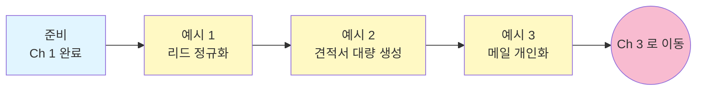

# Sales — Ch 2. 활용 (중급)

> **난이도**: 중급 ★★☆ | **소요 시간**: 30분 | **선수 학습**: [Ch 1. 사용법](./ch1-basics.md) 완료

Ch 1 에서 파일에 "말 걸기" 를 배웠다면, 이 챕터는 **CRM 리드 정규화, 견적서 대량 생성, 콜드 아웃리치 개인화** 처럼 **실제 세일즈 자동화** 를 다룹니다.

> **주의**: 이 챕터는 실제 고객 데이터를 가공하는 시나리오입니다. 반드시 [메인 README 8장 안전 수칙](../README.md#8-반드시-알아야-할-안전-수칙) 확인 후 진행하세요.

---

## 이 챕터에서 배우는 것

- CRM 에서 뽑은 **뒤죽박죽 리드 리스트를 자동 정규화** (회사명 · 지역 · 산업)
- 엑셀 템플릿 하나로 **견적서 30건 자동 생성** (1건 시연 후 대량 진행)
- 잠재 고객 리스트로 **개인화된 콜드 아웃리치 초안** 30건 생성

## 학습 흐름



## 이 챕터의 핵심 패턴

세일즈 데이터 자동화는 **사고 위험이 높은 영역** 입니다. 반드시 아래 3가지 습관을:

1. **원본 CSV 는 절대 덮어쓰지 말 것** → 결과는 `_normalized.csv` 같은 새 파일로
2. **`change_log.csv` 같은 검증용 부산물** 을 함께 생성
3. **사람이 최종 검토할 때까지 발송/제출 금지** — 이메일 초안은 사람 검수 후 발송

---

## 예시 1. CRM Export 리드 리스트 정규화

**상황**: Salesforce/HubSpot 에서 뽑은 리드 1,000건 CSV. 회사명 표기가 뒤죽박죽 ("삼성전자" / "Samsung Electronics" / "삼성전자(주)"), 지역명도 통일 안 됨.

**폴더 준비**:
```
~/work/crm-normalize-202607/
  crm_leads_202607.csv    (컬럼: name, company, email, phone, region, industry, source)
```

**프롬프트**:
```
crm_leads_202607.csv 를 정규화해줘. 원본은 절대 덮어쓰지 말고 새 파일로 저장.

정규화 규칙:
1. company_name 컬럼: 한글 정식명으로 통일
   - 예: "Samsung Electronics" -> "삼성전자", "(주)" 제거
   - 확신이 없으면 원본 유지하고 needs_review = Y
2. region 컬럼: 서울/경기/인천/부산/대구/광주/대전/그 외 로 정리
   - 도로명 주소가 컬럼에 있으면 참고
3. industry 컬럼이 비어있으면 회사명 기반으로 추정 값 채우기
   - 자신 없으면 "미확인" 표기
4. 이메일 도메인 기반 lead_type 컬럼 추가:
   - 무료 (gmail, naver, daum, kakao) -> "personal"
   - 그 외 -> "corporate"

출력 파일:
- crm_leads_normalized.csv (정규화된 결과)
- change_log.csv (변경 전/후 값 매핑 로그, 사람 검토용)
- normalize_summary.md (변경 통계 요약)

먼저 5건만 시연해서 change_log 를 보여주고, 내가 확인하면 나머지 진행해줘.
```

**예상 결과**:
- `crm_leads_normalized.csv`: 정규화된 1,000건
- `change_log.csv`: "이 필드는 이렇게 바뀌었다" 매핑
- `normalize_summary.md`:
  ```
  ## 정규화 요약
  - 총 리드: 1,000건
  - company_name 변경: 234건 (needs_review = Y: 12건)
  - region 통일: 456건
  - industry 추정 삽입: 178건 (미확인: 22건)
  - lead_type 분포: personal 340 / corporate 660
  ```

**팁**:
- **`change_log.csv` 는 반드시 요청** 하세요. 정규화가 잘못된 케이스를 나중에 확인할 수 있는 유일한 수단입니다.
- 신뢰도 낮은 판단은 `needs_review = Y` 로 마킹해서 사람이 검토할 수 있게.

---

## 예시 2. 견적서 30건 자동 생성

**상황**: 견적서 템플릿(`quote_template.xlsx`) 하나가 있고, 고객별 데이터(`clients.csv`) 로 30건을 만들어야 함.

**폴더 준비**:
```
~/work/quotes-202607/
  quote_template.xlsx     (치환 필드 {{CLIENT_NAME}} 등이 있는 xlsx)
  clients.csv             (컬럼: client_id, client_name, email, amount, contact_person)
```

**프롬프트**:
```
quote_template.xlsx 를 템플릿으로, clients.csv 의 각 행을 채워서
30개의 견적서 파일을 ./quotes/ 폴더에 만들어줘.

파일명: quote_{client_id}_{client_name}_{YYYYMMDD}.xlsx
- YYYYMMDD 는 오늘 날짜
- client_name 의 공백은 _ 로 대체, 특수문자 제거

템플릿 안의 아래 셀 치환:
- {{CLIENT_NAME}} -> client_name
- {{CONTACT_PERSON}} -> contact_person
- {{CONTACT_EMAIL}} -> email
- {{AMOUNT}} -> amount (콤마 구분자, "원" 붙이기)
- {{ISSUE_DATE}} -> today (YYYY-MM-DD)
- {{VALID_UNTIL}} -> today + 30 days (YYYY-MM-DD)

먼저 첫 번째 클라이언트만 시연해서 결과 xlsx 를 열어볼 수 있게 만들어줘.
내가 결과를 확인하고 승인하면 나머지 29건 진행.

마지막에 generated_quotes_list.csv 로 생성 로그 (client_id / 파일명 / 생성 시각) 를 저장.
```

**예상 결과**:
- `./quotes/` 폴더에 30개 견적서 xlsx 생성
- `generated_quotes_list.csv` 로그 파일
- 시연 단계에서 실수를 잡을 수 있음

**팁**:
- **"먼저 1건만" 패턴은 대량 생성 작업의 표준** 입니다. 처음 몇 번은 항상 이렇게.
- 견적 금액이 숫자가 아닌 문자열로 잘못 들어가는 실수를 시연에서 잡을 수 있음.
- 견적서 xlsx 의 서식(폰트, 색상, 셀 병합) 이 깨지지 않게 유지해달라고 명시하는 것도 좋음: **"템플릿의 서식은 그대로 유지"**

---

## 예시 3. 콜드 아웃리치 메일 30건 개인화

**상황**: 잠재 고객 30명 리스트가 있다. 각자에게 맞춤형 인트로 문장을 넣은 이메일 초안 30개가 필요.

**폴더 준비**:
```
~/work/cold-outreach-202607/
  prospects.csv           (컬럼: name, title, company, industry, recent_news)
  product_pitch.md        (우리 회사 소개 3~4줄)
```

**프롬프트**:
```
prospects.csv 를 기반으로 각 잠재 고객에게 보낼 이메일 초안을
outreach/{company_slug}_{name}.md 형태로 생성해줘.
- company_slug: 회사명을 소문자 + 공백을 -로 대체 (예: "카카오 뱅크" -> "kakao-bank")

각 이메일 규칙:
1. 제목: [회사이름] 관련 15분만 시간 되실까요?
2. 인사말: 이름 + title 로 시작 (title 없으면 "님")
3. 첫 문장: recent_news 를 자연스럽게 참조 (1문장)
4. 두 번째 문단: 우리 회사 소개 (product_pitch.md 참고, 3~4줄로 요약)
5. 마지막: 15분 통화 제안 + calendly 링크 (https://cal.com/example)

톤: 정중하지만 딱딱하지 않게. 각 메일 최대 200자 이내.

각 파일 최상단에 아래 주석을 반드시 포함:
> ⚠️ 자동 생성된 초안입니다. 발송 전 반드시 사람이 검토하세요.
> - recent_news 참조가 자연스러운지 확인
> - 오탈자·존칭 확인
> - 링크 정상 동작 확인

먼저 3건만 시연해주고, 톤이 맞으면 나머지 27건 진행해줘.

마지막에 outreach/README.md 로 발송 리스트 (파일명 / 대상 회사 / 대상자 / 우리쪽 담당) 요약.
```

**예상 결과**:
- `outreach/` 폴더에 30개 개인화된 초안
- 각 파일 최상단에 "검토 후 발송" 경고
- `outreach/README.md` 로 발송 매니페스트

**팁**:
- **자동 발송 절대 금지** — 이메일 초안은 반드시 사람이 최종 확인 후 발송.
- **`recent_news` 참조가 잘못된 케이스** 가 종종 있음 (뉴스 해석 오류). 시연 3건에서 이런 이슈를 잡을 수 있음.
- 톤이 안 맞으면 **"1번 이메일이 너무 딱딱해. 좀 더 캐주얼하게 다시 써줘"** 로 그 자리에서 조정.

---

## 이 챕터 완료 체크리스트

- [ ] 예시 1을 실행해서 `crm_leads_normalized.csv` + `change_log.csv` 가 생성됐다
- [ ] `change_log.csv` 를 열어서 실제로 변경 내역을 확인했다
- [ ] 예시 2를 실행해서 견적서 30개가 `./quotes/` 에 생성됐다
- [ ] 첫 1건 시연 → 승인 → 나머지 패턴을 직접 경험했다
- [ ] 예시 3을 실행해서 개인화된 이메일 30건이 생성됐다
- [ ] 각 이메일 최상단에 "검토 후 발송" 경고가 자동 삽입된 것을 확인했다

## 3개 다 성공했다면

**축하합니다.** 세일즈의 반복 잡업 자동화 감을 잡았습니다. 이제 계약서 감사 · TAM 분석 같은 **판단이 개입하는 고급 워크플로우** 로 갑니다.

## 다음 챕터로

→ [Ch 3. 현업 활용 — 계약서 감사 · TAM 분석 · 파이프라인 리뷰](./ch3-professional.md) (60분+)

## 관련 문서

- 챕터 인덱스: [Sales 로드맵](./README.md)
- 이전 챕터: [Ch 1. 사용법](./ch1-basics.md)
