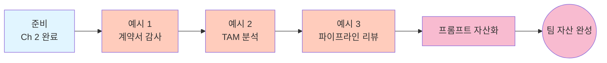

# Sales — Ch 3. 현업 활용 (고급)

> **난이도**: 고급 ★★★ | **소요 시간**: 60분+ | **선수 학습**: [Ch 2. 활용](./ch2-application.md) 완료

Ch 2 에서 반복 자동화를 배웠다면, 이 챕터는 **판단이 개입하는 계약서 감사, 여러 자료를 통합한 TAM 분석, 정기 파이프라인 리뷰** 를 팀 자산으로 만드는 방법을 다룹니다.

여기까지 오시면 세일즈 팀의 매월 반복 작업을 30분 안에 끝낼 수 있습니다.

---

## 이 챕터에서 배우는 것

- 계약서 PDF 20건에서 **특정 조항을 감사** (신뢰도 컬럼 필수)
- 여러 통계 자료를 통합해 **지역별 TAM 분석 리포트** 자동 생성
- CRM · 활동 로그 · 딜 데이터를 통합해 **월간 파이프라인 리뷰** 자동화
- 위 워크플로우를 **팀 자산화** (사내 위키, `.github/copilot-instructions.md`)

## 학습 흐름



## 이 챕터의 핵심 패턴

세일즈 현업 자동화는 **판단의 신뢰성 + 근거 추적성** 이 핵심:

1. **모든 AI 판단에 "신뢰도" 컬럼** — low 는 반드시 사람 재확인
2. **"데이터 소스 · 페이지" 컬럼 필수** — 임원 질문에 근거 즉답
3. **개인정보 · 계약 데이터는 로컬 샌드박스** (`/sandbox enable`)
4. **정기 리포트 프롬프트를 사내 위키 자산화**

---

## 예시 1. 계약서 PDF 20건 조항 감사

**상황**: 지난해 체결된 계약서 20건 PDF 에서 "자동 갱신 조항" 이 있는지, 있다면 갱신 통보 기한 · 위약금 조건을 감사해야 함. 법무팀 전달 전 초안 정리.

**폴더 준비**:
```
~/work/contract-audit-2026/
  contracts/
    2025_01_회사A_계약서.pdf
    2025_02_회사B_계약서.pdf
    ...(총 20건)
  audit_checklist.md              (감사 항목 정의)
```

**프롬프트**:
```
./contracts/ 폴더의 모든 PDF 를 읽어서 "자동 갱신 조항" 을 감사해줘.
audit_checklist.md 에 정의된 항목을 반드시 참고.

산출물: contract_audit_report.csv

컬럼:
- 파일명
- 계약 당사자 (양측)
- 계약 시작일 / 만료일
- 자동 갱신 조항 유무 (Y/N/Unclear)
- 갱신 통보 기한 (일수, 없으면 빈칸)
- 갱신 시 조건 변경 (있으면 원문 인용)
- 위약금 조항 (있으면 원문 인용 + 금액/비율)
- 페이지 번호 (해당 조항이 있는 페이지)
- 신뢰도 (high/medium/low)
- 판단 근거 (1문장)

low 신뢰도 건은 파일명에 [REVIEW] 태그를 붙여줘.

또한 별도 산출물:
- contract_audit_summary.md (감사 요약 리포트)
  - Executive Summary: 20건 중 자동갱신 N건, 위약금 조항 N건, 재검토 필요 N건
  - 갱신 기한이 30일 이내로 임박한 계약 리스트 (있으면)
  - 위약금 조항이 특이하게 높은 계약 리스트 (top 3)
  - 재검토 필요 (low 신뢰도) 파일 리스트 + 사유

- redlines_to_review.md (사람이 반드시 재확인해야 할 조항 상세)
  - 각 low 신뢰도 파일에 대해 해당 조항의 원문 인용 + AI 가 판단하기 어려운 이유

주의:
- 원문 인용은 절대 요약하지 말고 그대로 발췌
- 판단 애매하면 "Unclear" 로 표기하고 low 신뢰도
- 개인정보 (담당자 이름 · 연락처) 는 CSV 에 포함하지 말 것

먼저 3건만 감사해서 결과 형식이 맞는지 보여주고, 승인 후 나머지 17건 진행.
```

**예상 결과**:
- `contract_audit_report.csv`: 20건 전체 감사 결과 (엑셀에서 열어 필터링 가능)
- `contract_audit_summary.md`: 법무팀 보고용 요약
- `redlines_to_review.md`: 사람 재확인 필수 부분 상세

**팁**:
- **원본 조항 인용 유지가 핵심** — 요약하다가 뜻이 달라지면 법적 리스크.
- **신뢰도 low 는 반드시 사람 재확인** — Copilot 이 잘못 판단한 것을 발견할 수 있는 유일한 방어선.
- 법무팀에 전달하기 전 반드시 검토 완료 후 문서 상단에 "AI 감사 초안 → 사람 검토 완료 (검토자: 홍길동, 2026-07-27)" 스탬프 추가.

---

## 예시 2. 지역별 TAM 산정 자료 통합

**상황**: 신규 진출 검토 중인 6개 도시. 통계청, KOSIS, 시장조사 리포트 5개 문서에서 데이터를 뽑아 도시별 TAM 을 산정하고 이사회에 보고해야 함.

**폴더 준비**:
```
~/work/tam-analysis-2026/
  sources/
    01_통계청_인구현황_2026.xlsx
    02_KOSIS_산업체수.csv
    03_시장조사_경쟁사매장.pdf
    04_카드사데이터_소비트렌드.xlsx
    05_지역별_인구통계_상세.pdf
  assumptions.md                   (TAM 산정 가정: 평균 계약 단가 등)
```

**프롬프트**:
```
./sources/ 폴더의 5개 자료를 통합해서 신규 진출 6개 도시(서울/부산/대구/인천/광주/대전) 의
TAM 분석 리포트를 만들어줘. assumptions.md 의 가정을 반드시 참고.

산출물:
1. tam_analysis_2026.md (이사회 보고용 리포트, 10 페이지 이내)
2. tam_data.csv (도시 × 지표 원시 데이터)
3. tam_sources.md (모든 수치의 출처 명세)

리포트 구조:
## 1. Executive Summary
- 6개 도시 총 TAM 합계
- Top 3 진출 우선순위 추천 (근거 함께)
- 주요 리스크 3가지

## 2. 도시별 분석 (각 도시마다)
### 서울
- 인구 수 (출처: 자료 1, 페이지 X)
- 잠재 산업체 수 (출처: 자료 2)
- 경쟁사 매장 수 (출처: 자료 3, 표 4)
- 소비 트렌드 관련 지표 (출처: 자료 4)
- TAM 추정치 = 잠재 산업체 수 × assumptions.md 의 평균 계약 단가
- 진출 매력도 점수 (10점 만점, 산정 근거 명시)

## 3. 비교 매트릭스
- 6개 도시 × 6~8개 핵심 지표 표 (한눈에 비교)

## 4. 진출 우선순위 제안
- Top 3 도시별로: 진출 시점 · 초기 투자 · 예상 회수 기간

## 5. 리스크와 가정의 한계
- 데이터의 신뢰도 이슈 (자료 3의 경쟁사 매장 수는 2024년 기준 등)
- 산정 가정 검증 필요 사항

data.csv 컬럼:
- 도시, 인구, 잠재_산업체수, 경쟁사_매장수, TAM_추정치_원, 진출_매력도_점수, 신뢰도, 출처_파일들

sources.md 는:
- 각 수치가 어느 파일 · 어느 페이지 · 어느 표에서 나왔는지 완전한 추적성 제공

주의:
- "데이터 소스 · 페이지" 없이 수치를 만들지 말 것
- 자료 간 수치 충돌이 있으면 별도 표기 + 어느 것을 채택했는지 근거
- 계산 공식은 리포트에 명시 (TAM = ... × ...)
- 신뢰도 낮은 수치는 별표 + 각주로 사유

먼저 서울 1개 도시만 시연해서 리포트 형식과 소스 추적 방식이 맞는지 보여주고,
승인 후 나머지 5개 도시 진행.
```

**예상 결과**:
- 이사회에 즉시 상정 가능한 3종 산출물
- 임원 질문 ("이 숫자 어디서 나왔어?") 에 `tam_sources.md` 로 즉답 가능

**팁**:
- **"먼저 1개 도시만 시연"** — 5개 자료 통합은 실수 확률이 높으므로 반드시 검증 스텝.
- **`assumptions.md`** 는 팀 내 논의 결과를 담아두면 매년 재활용 가능.

---

## 예시 3. 월간 파이프라인 리뷰 자동화

**상황**: 매월 첫 영업일 오후 파이프라인 리뷰 회의. 지난달 파이프라인 진행 · 이번 달 예측 · 리스크를 한 페이지로 정리해야 함.

**폴더 준비**:
```
~/work/pipeline-review-202608/
  crm_export_202607.csv           (지난달 CRM 스냅샷)
  crm_export_202608_current.csv   (이번달 현재 스냅샷)
  activity_log_202607.csv         (영업 활동 로그: 콜, 미팅, 이메일)
  deals_closed_202607.csv         (지난달 클로징된 딜)
  deals_lost_202607.csv           (지난달 실패한 딜)
  team_quota_2026.md              (팀 쿼터 목표)
```

**프롬프트**:
```
이 폴더의 모든 CRM 데이터를 통합해서 pipeline_review_202608.md 를 만들어줘.
team_quota_2026.md 의 목표와 비교.

문서 구조 (한 페이지):

## Pipeline Review · 2026년 8월

### 지난달 성과 요약
- 클로징 딜 수 / 총 매출 / 평균 딜 크기 / 승률
- 쿼터 달성률 (팀 전체, 개인별 top/bottom 3)

### 이번달 파이프라인 스냅샷
- 스테이지별 딜 수 & 예상 매출 (Prospect → Qualified → Proposal → Negotiation → Closed)
- 이번달 예상 클로징 (신뢰도별: high/medium/low)
- 목표 대비 갭 (부족하면 얼마나)

### Deals to Watch (즉시 팔로업 필요)
- 30일 이상 스테이지 정체 딜 (Aging Analysis)
- 큰 딜 (평균 딜 크기의 3배 이상) 리스트 + 담당자
- 최근 활동이 뜸한 딜 (14일 이상 미접촉)

### 지난달 Lost 분석
- 이유별 분포 (예산 / 경쟁사 / 타이밍 / 기타)
- 재도전 가능성 있는 딜 3건

### 다음 30일 팀 액션 제안
- 3가지 (개인별 팔로업, 팀 캠페인, 프로세스 개선 각 1개씩)

포맷:
- 표 위주
- 담당자 이름은 이니셜로 익명화 옵션 (원본 CSV 에는 있으되 리뷰 리포트는 익명)
- 금액은 콤마 구분자 (KRW)
- 각 지표마다 데이터 소스 파일명 각주

주의:
- 원본 CRM 데이터는 절대 수정하지 말 것
- 개인별 성과 표시는 회사 정책에 따라 활성/비활성 가능 (기본 활성, 매니저 검토 후 조정)
- Lost 이유 분석은 원문 노트를 그대로 인용 (요약 시 미묘한 뉘앙스 손실)

먼저 "지난달 성과 요약" 섹션만 초안으로 보여주고, 톤/포맷 확인 후 전체 진행.
```

**예상 결과**: 파이프라인 리뷰 회의 자료 A4 한 장. 회의 시작 15분 전에 실행하면 됨.

**팁**:
- 매월 첫 영업일 자동 실행 루틴 만들기.
- `team_quota_2026.md` 는 팀 목표의 소스 오브 트루스로 유지.

---

## 프롬프트를 팀 자산으로 만드는 방법

Ch 3 까지 완료했다면 팀 자산화 스텝:

### 1. 사내 위키에 세일즈 프롬프트 라이브러리

```markdown
# Sales Copilot CLI 프롬프트 라이브러리

## 정기 리포트
- [월간 파이프라인 리뷰](./monthly-pipeline-review.md)
- [분기 계약서 자동 갱신 감사](./quarterly-contract-audit.md)

## 프로젝트성
- [지역별 TAM 분석](./tam-analysis.md)
- [경쟁사 조항 벤치마킹](./competitor-clause-comparison.md)

## 데일리 오퍼레이션
- [CRM 리드 정규화](./crm-lead-normalization.md)
- [견적서 대량 생성](./quote-batch-generation.md)
- [콜드 아웃리치 개인화](./cold-outreach-personalization.md)
```

### 2. `.github/copilot-instructions.md` 에 세일즈 컨텍스트

```markdown
# 회사 세일즈팀 컨텍스트

## 딜 스테이지 정의
- Prospect: 첫 컨택 이전
- Qualified: BANT 확인 완료
- Proposal: 견적 제출
- Negotiation: 계약서 협상
- Closed Won / Closed Lost

## 파이프라인 지표
- 승률 = Closed Won / (Closed Won + Closed Lost) × 100
- 평균 딜 크기 = Closed Won 총 매출 / Closed Won 건수
- 사이클 = Prospect → Closed 평균 일수

## 개인정보 처리 원칙
- 이메일/전화는 결과 파일에 포함 금지 (내부 CRM 참조로만)
- 계약서 감사 결과에는 회사명만, 담당자 이름은 마스킹
- 로컬 샌드박스 필수 (/sandbox enable)
```

### 3. 정기 실행 루틴

```
매월 첫 영업일 오전  → 월간 파이프라인 리뷰 (Ch 3 예시 3)
분기 첫 주          → 계약서 자동 갱신 감사 (Ch 3 예시 1)
프로젝트 킥오프 시  → 지역별 TAM 분석 (Ch 3 예시 2)
```

---

## 이 챕터 완료 체크리스트

- [ ] 예시 1을 실행해서 계약서 감사 리포트 3종 (CSV, MD, redlines) 이 생성됐다
- [ ] 신뢰도 low 인 조항을 실제로 사람이 재확인했다
- [ ] 예시 2를 실행해서 TAM 분석 리포트 3종이 생성됐다
- [ ] `tam_sources.md` 에 모든 수치의 출처가 명확히 추적된 것을 확인했다
- [ ] 예시 3을 실행해서 파이프라인 리뷰 자료가 A4 한 장으로 정리됐다
- [ ] 프롬프트 하나를 사내 위키에 저장했다
- [ ] `.github/copilot-instructions.md` 에 딜 스테이지 정의를 넣었다

## 3개 다 성공했다면

**축하합니다.** 세일즈 팀의 반복 리포트 자동화 자산 3개를 확보. 매월 4~6시간의 반복 작업이 30분으로 줄어듭니다.

## 지금부터

- 프롬프트를 팀 위키에 저장
- 다른 직군 폴더 훑기:
  - [Marketing](../marketing/) — 캠페인 리포트
  - [HR / Ops](../hr-ops/) — 팀 인사 데이터
- 새 시나리오는 Issue / PR 로 기여

## 관련 문서

- 챕터 인덱스: [Sales 로드맵](./README.md)
- 이전 챕터: [Ch 2. 활용](./ch2-application.md)
- 메인 README: [../README.md](../README.md)
